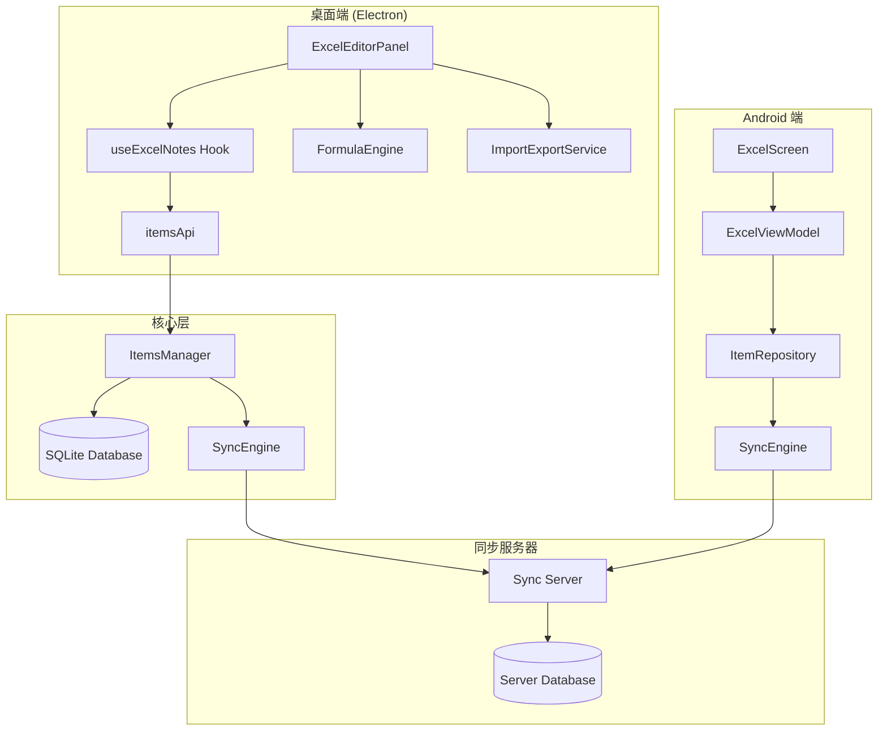
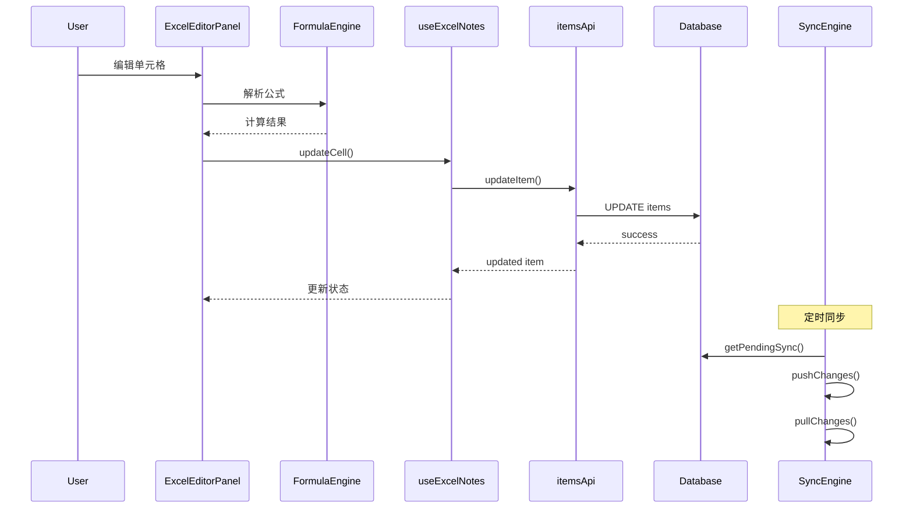

# Design Document: Excel Notes

## Overview

本设计文档描述了为暮城笔记应用添加 Excel 格式笔记支持的技术实现方案。该功能将允许用户在应用内创建、编辑类似电子表格的笔记，支持多工作表、简单公式计算、单元格格式化，并通过现有同步系统实现多终端数据同步。

设计遵循现有架构模式，将 Excel 笔记作为新的 `ItemType` 集成到统一的数据模型中，复用现有的同步引擎、数据库管理和 UI 框架。

## Architecture

### 系统架构图



### 数据流



## Components and Interfaces

### 1. 类型定义 (src/shared/types/index.ts)

```typescript
// 新增 ItemType
export type ItemType =
  | 'note'
  | 'folder'
  | 'tag'
  | 'resource'
  | 'todo'
  | 'vault_entry'
  | 'vault_folder'
  | 'bookmark'
  | 'bookmark_folder'
  | 'diagram'
  | 'ai_config'
  | 'ai_conversation'
  | 'ai_message'
  | 'excel_note';  // 新增

// Excel 笔记 Payload
export interface ExcelNotePayload {
  title: string;
  description: string;
  folder_id: string | null;
  is_pinned: boolean;
  is_locked: boolean;
  lock_password_hash: string | null;
  tags: string[];
  sheets: ExcelSheet[];
  active_sheet_index: number;
}

// 工作表
export interface ExcelSheet {
  id: string;
  name: string;
  rows: ExcelRow[];
  column_widths: number[];
  row_heights: number[];
  frozen_rows: number;
  frozen_columns: number;
}

// 行数据
export interface ExcelRow {
  row_index: number;
  cells: ExcelCell[];
}

// 单元格
export interface ExcelCell {
  column_index: number;
  value: CellValue;
  formula: string | null;
  style: CellStyle | null;
}

// 单元格值类型
export type CellValue = string | number | boolean | null;

// 单元格样式
export interface CellStyle {
  font_bold: boolean;
  font_italic: boolean;
  font_color: string | null;
  background_color: string | null;
  text_align: 'left' | 'center' | 'right';
  vertical_align: 'top' | 'middle' | 'bottom';
  number_format: NumberFormat | null;
}

// 数字格式类型
export type NumberFormat = 
  | { type: 'general' }
  | { type: 'number'; decimals: number }
  | { type: 'percentage'; decimals: number }
  | { type: 'currency'; symbol: string; decimals: number }
  | { type: 'date'; pattern: string };

// 功能开关扩展
export interface FeatureSettings {
  ai_enabled: boolean;
  todo_enabled: boolean;
  vault_enabled: boolean;
  bookmark_enabled: boolean;
  toolbox_enabled: boolean;
  diagram_enabled: boolean;
  transfer_enabled: boolean;
  excel_enabled: boolean;  // 新增
}

// 同步模块扩展
export const SYNC_MODULE_TYPES: Record<keyof SyncModules, ItemType[]> = {
  notes: ['note', 'folder', 'tag', 'resource', 'excel_note'],  // 添加 excel_note
  bookmarks: ['bookmark', 'bookmark_folder'],
  vault: ['vault_entry', 'vault_folder'],
  diagrams: ['diagram'],
  todos: ['todo'],
  ai: ['ai_config', 'ai_conversation', 'ai_message'],
};
```

### 2. 公式引擎 (src/core/excel/FormulaEngine.ts)

```typescript
export interface FormulaResult {
  value: CellValue;
  error: string | null;
}

export interface CellReference {
  sheet_id: string;
  row: number;
  column: number;
  absolute_row: boolean;
  absolute_column: boolean;
}

export interface FormulaEngine {
  // 解析公式字符串
  parse(formula: string): ParsedFormula;
  
  // 计算公式结果
  evaluate(
    formula: string,
    getCellValue: (ref: CellReference) => CellValue
  ): FormulaResult;
  
  // 获取公式依赖的单元格
  getDependencies(formula: string): CellReference[];
  
  // 检查循环引用
  checkCircularReference(
    cellRef: CellReference,
    formula: string,
    getCellFormula: (ref: CellReference) => string | null
  ): boolean;
}

// 支持的函数
export type FormulaFunction = 
  | 'SUM' 
  | 'AVERAGE' 
  | 'COUNT' 
  | 'MAX' 
  | 'MIN'
  | 'IF'
  | 'ROUND';
```

### 3. React Hook (src/renderer/hooks/useExcelNotes.ts)

```typescript
export interface UseExcelNotesReturn {
  // 状态
  excelNotes: ItemBase[];
  currentNote: ItemBase | null;
  currentSheet: ExcelSheet | null;
  loading: boolean;
  error: string | null;
  canUndo: boolean;
  canRedo: boolean;
  
  // 笔记操作
  createExcelNote: (folderId?: string) => Promise<ItemBase>;
  updateExcelNote: (id: string, payload: Partial<ExcelNotePayload>) => Promise<void>;
  deleteExcelNote: (id: string) => Promise<void>;
  selectExcelNote: (id: string) => void;
  
  // 工作表操作
  addSheet: () => void;
  deleteSheet: (sheetId: string) => void;
  renameSheet: (sheetId: string, name: string) => void;
  selectSheet: (sheetIndex: number) => void;
  reorderSheets: (fromIndex: number, toIndex: number) => void;
  
  // 单元格操作
  updateCell: (row: number, col: number, value: CellValue, formula?: string) => void;
  updateCellStyle: (row: number, col: number, style: Partial<CellStyle>) => void;
  updateCellRange: (startRow: number, startCol: number, endRow: number, endCol: number, style: Partial<CellStyle>) => void;
  
  // 行列操作
  insertRow: (rowIndex: number) => void;
  deleteRow: (rowIndex: number) => void;
  insertColumn: (colIndex: number) => void;
  deleteColumn: (colIndex: number) => void;
  setColumnWidth: (colIndex: number, width: number) => void;
  setRowHeight: (rowIndex: number, height: number) => void;
  setFrozenRows: (count: number) => void;
  setFrozenColumns: (count: number) => void;
  
  // 复制粘贴操作
  copySelection: () => void;
  cutSelection: () => void;
  pasteAtSelection: () => void;
  
  // 撤销重做操作
  undo: () => void;
  redo: () => void;
}
```

### 4. 编辑器组件 (src/renderer/components/ExcelEditorPanel.tsx)

```typescript
interface ExcelEditorPanelProps {
  noteId: string | null;
  onNoteChange?: (noteId: string) => void;
}

// 组件结构
// - ExcelToolbar: 工具栏（格式化、公式栏等）
// - SheetTabs: 工作表标签栏
// - SpreadsheetGrid: 表格网格（使用虚拟滚动）
// - FormulaBar: 公式编辑栏
// - ContextMenu: 右键菜单
```

### 5. 导入导出服务 (src/core/excel/ImportExportService.ts)

```typescript
export interface ImportExportService {
  // 导入
  importXlsx(file: File): Promise<ExcelNotePayload>;
  importCsv(file: File): Promise<ExcelNotePayload>;
  
  // 导出
  exportToXlsx(payload: ExcelNotePayload): Promise<Blob>;
  exportToCsv(sheet: ExcelSheet): Promise<Blob>;
}
```

## Data Models

### 数据库存储

Excel 笔记使用现有的 `items` 表存储，通过 `type = 'excel_note'` 区分：

```sql
-- 现有 items 表结构（无需修改）
CREATE TABLE items (
  id TEXT PRIMARY KEY,
  type TEXT NOT NULL,           -- 'excel_note'
  created_time INTEGER NOT NULL,
  updated_time INTEGER NOT NULL,
  deleted_time INTEGER,
  payload TEXT NOT NULL,        -- JSON: ExcelNotePayload
  content_hash TEXT NOT NULL,
  sync_status TEXT DEFAULT 'clean',
  local_rev INTEGER DEFAULT 0,
  remote_rev TEXT,
  encryption_applied INTEGER DEFAULT 0,
  schema_version INTEGER DEFAULT 1
);
```

### Payload 结构示例

```json
{
  "title": "销售数据表",
  "description": "",
  "folder_id": "uuid-folder-1",
  "is_pinned": false,
  "is_locked": false,
  "lock_password_hash": null,
  "tags": ["工作", "数据"],
  "sheets": [
    {
      "id": "sheet-1",
      "name": "Sheet1",
      "rows": [
        {
          "row_index": 0,
          "cells": [
            { "column_index": 0, "value": "产品", "formula": null, "style": { "font_bold": true } },
            { "column_index": 1, "value": "销量", "formula": null, "style": { "font_bold": true } },
            { "column_index": 2, "value": "单价", "formula": null, "style": { "font_bold": true } },
            { "column_index": 3, "value": "总额", "formula": null, "style": { "font_bold": true } }
          ]
        },
        {
          "row_index": 1,
          "cells": [
            { "column_index": 0, "value": "产品A", "formula": null, "style": null },
            { "column_index": 1, "value": 100, "formula": null, "style": null },
            { "column_index": 2, "value": 50, "formula": null, "style": null },
            { "column_index": 3, "value": 5000, "formula": "=B2*C2", "style": null }
          ]
        }
      ],
      "column_widths": [100, 80, 80, 100],
      "row_heights": [25, 25],
      "frozen_rows": 1,
      "frozen_columns": 0
    }
  ],
  "active_sheet_index": 0
}
```

### Android 端数据模型 (Kotlin)

```kotlin
@Serializable
data class ExcelNotePayload(
    val title: String,
    val description: String = "",
    @SerialName("folder_id") val folderId: String? = null,
    @SerialName("is_pinned") val isPinned: Boolean = false,
    @SerialName("is_locked") val isLocked: Boolean = false,
    @SerialName("lock_password_hash") val lockPasswordHash: String? = null,
    val tags: List<String> = emptyList(),
    val sheets: List<ExcelSheet>,
    @SerialName("active_sheet_index") val activeSheetIndex: Int = 0
)

@Serializable
data class ExcelSheet(
    val id: String,
    val name: String,
    val rows: List<ExcelRow>,
    @SerialName("column_widths") val columnWidths: List<Int> = emptyList(),
    @SerialName("row_heights") val rowHeights: List<Int> = emptyList(),
    @SerialName("frozen_rows") val frozenRows: Int = 0,
    @SerialName("frozen_columns") val frozenColumns: Int = 0
)

@Serializable
data class ExcelRow(
    @SerialName("row_index") val rowIndex: Int,
    val cells: List<ExcelCell>
)

@Serializable
data class ExcelCell(
    @SerialName("column_index") val columnIndex: Int,
    val value: JsonElement?, // String, Number, Boolean, or null
    val formula: String? = null,
    val style: CellStyle? = null
)

@Serializable
data class CellStyle(
    @SerialName("font_bold") val fontBold: Boolean = false,
    @SerialName("font_italic") val fontItalic: Boolean = false,
    @SerialName("font_color") val fontColor: String? = null,
    @SerialName("background_color") val backgroundColor: String? = null,
    @SerialName("text_align") val textAlign: String = "left",
    @SerialName("vertical_align") val verticalAlign: String = "middle",
    @SerialName("number_format") val numberFormat: String? = null
)
```

## Correctness Properties

*A property is a characteristic or behavior that should hold true across all valid executions of a system-essentially, a formal statement about what the system should do. Properties serve as the bridge between human-readable specifications and machine-verifiable correctness guarantees.*

### Property 1: Excel_Note 创建不变量

*For any* newly created Excel_Note, the system SHALL assign a valid UUID, set type to 'excel_note', initialize all default properties correctly, and set sync_status to 'modified'.

**Validates: Requirements 1.2, 1.3, 1.5**

### Property 2: 工作表数量不变量

*For any* Excel_Note, after adding a sheet the sheets array length SHALL increase by exactly one, and after deleting a sheet (when more than one exists) the length SHALL decrease by exactly one.

**Validates: Requirements 2.1, 2.3**

### Property 3: 最后工作表保护

*For any* Excel_Note with exactly one sheet, attempting to delete that sheet SHALL fail and the sheet SHALL remain.

**Validates: Requirements 2.4**

### Property 4: 工作表重排序保持数据完整性

*For any* Excel_Note, after reordering sheets, the sheets array SHALL contain the same sheet objects (by id) in a different order, with no data loss.

**Validates: Requirements 2.6**

### Property 5: 单元格值类型正确性

*For any* cell value of type string, number, or boolean, storing and retrieving the value SHALL preserve its type and content exactly.

**Validates: Requirements 3.7**

### Property 6: 公式识别

*For any* cell input starting with '=', the system SHALL interpret it as a formula and store it in the formula field.

**Validates: Requirements 4.1**

### Property 7: 公式计算正确性

*For any* valid arithmetic formula with cell references, the Formula_Engine SHALL compute the correct result matching standard spreadsheet semantics.

**Validates: Requirements 4.2, 4.3, 4.4**

### Property 8: 聚合函数正确性

*For any* range of numeric cells, SUM SHALL return the sum, AVERAGE SHALL return the arithmetic mean, COUNT SHALL return the count of non-empty cells, MAX SHALL return the maximum, and MIN SHALL return the minimum.

**Validates: Requirements 4.5, 4.6, 4.7, 4.8**

### Property 9: 公式错误处理

*For any* invalid formula (syntax error, circular reference, invalid reference), the system SHALL return an error indicator rather than crash or return incorrect results.

**Validates: Requirements 4.11**

### Property 10: 公式依赖重算

*For any* cell with a formula referencing other cells, when any referenced cell value changes, the formula SHALL be recalculated to reflect the new value.

**Validates: Requirements 4.12**

### Property 11: 单元格样式持久化

*For any* cell with style properties (bold, italic, colors, alignment), the style SHALL be correctly stored in the payload and retrieved unchanged.

**Validates: Requirements 5.1, 5.2, 5.3, 5.4, 5.5, 5.6**

### Property 12: 行列操作数据完整性

*For any* row/column insertion or deletion, all existing cell data SHALL be preserved and correctly shifted, with no data loss.

**Validates: Requirements 6.1, 6.2, 6.3, 6.4**

### Property 13: 内容哈希变更检测

*For any* modification to an Excel_Note (cell value, style, sheet structure), the content_hash SHALL change to a different value.

**Validates: Requirements 7.1**

### Property 14: 同步往返一致性

*For any* Excel_Note, after pushing to remote and pulling back, the payload SHALL be equivalent to the original (excluding sync metadata).

**Validates: Requirements 7.2, 7.3**

### Property 15: 导入导出往返

*For any* valid Excel_Note, exporting to .xlsx and importing back SHALL produce an equivalent payload (cell values and basic formatting preserved).

**Validates: Requirements 8.3, 8.5**

### Property 16: CSV 导入导出往返

*For any* single-sheet Excel_Note with text/number values, exporting to CSV and importing back SHALL produce equivalent cell values.

**Validates: Requirements 8.2, 8.4**

### Property 17: 无效文件导入拒绝

*For any* invalid or corrupted file, the import operation SHALL fail gracefully with an error message and not create a malformed Excel_Note.

**Validates: Requirements 8.6**

### Property 18: 功能开关同步过滤

*For any* sync operation with excel_enabled=false, no excel_note items SHALL be included in push or pull operations.

**Validates: Requirements 9.3**

### Property 19: 公式缓存一致性

*For any* formula, repeated evaluation without dependency changes SHALL return the same cached result.

**Validates: Requirements 13.4**

### Property 20: 复制粘贴数据完整性

*For any* copy-paste operation, the pasted cells SHALL contain the same values, formulas (with adjusted references), and styles as the source cells.

**Validates: Requirements 11.3, 11.4, 11.5**

### Property 21: 撤销重做一致性

*For any* sequence of edits followed by undo operations, the spreadsheet state SHALL return to the exact state before those edits.

**Validates: Requirements 12.1, 12.4**

### Property 22: 撤销重做对称性

*For any* undo operation followed by a redo operation, the spreadsheet state SHALL return to the state before the undo.

**Validates: Requirements 12.1, 12.2**

## Error Handling

### 公式错误

| 错误类型 | 错误码 | 显示 | 处理方式 |
|---------|--------|------|---------|
| 语法错误 | #SYNTAX! | 单元格显示错误标记 | 保留原公式，显示错误提示 |
| 循环引用 | #REF! | 单元格显示错误标记 | 阻止保存，提示用户修正 |
| 除零错误 | #DIV/0! | 单元格显示错误标记 | 显示错误值 |
| 无效引用 | #REF! | 单元格显示错误标记 | 显示错误值 |
| 类型错误 | #VALUE! | 单元格显示错误标记 | 显示错误值 |

### 导入导出错误

| 错误类型 | 处理方式 |
|---------|---------|
| 文件格式不支持 | 显示错误提示，建议支持的格式 |
| 文件损坏 | 显示错误提示，建议重新获取文件 |
| 文件过大 | 显示警告，建议分割文件 |
| 导出失败 | 显示错误提示，建议重试 |

### 同步错误

| 错误类型 | 处理方式 |
|---------|---------|
| 网络错误 | 保留本地修改，下次同步重试 |
| 冲突 | 创建冲突副本，保留两个版本 |
| 服务器错误 | 记录错误日志，下次同步重试 |

## Testing Strategy

### 单元测试

1. **FormulaEngine 测试**
   - 公式解析正确性
   - 各函数计算正确性
   - 错误处理
   - 循环引用检测

2. **ImportExportService 测试**
   - XLSX 导入/导出
   - CSV 导入/导出
   - 边界情况处理

3. **useExcelNotes Hook 测试**
   - CRUD 操作
   - 状态管理
   - 错误处理

### 属性测试 (Property-Based Testing)

使用 `fast-check` 库进行属性测试，每个测试至少运行 100 次迭代。

1. **Property 1 测试**: Excel_Note 创建不变量
2. **Property 5 测试**: 单元格值类型正确性
3. **Property 7 测试**: 公式计算正确性
4. **Property 8 测试**: 聚合函数正确性
5. **Property 15 测试**: 导入导出往返
6. **Property 20 测试**: 复制粘贴数据完整性
7. **Property 21 测试**: 撤销重做一致性

### 集成测试

1. **同步测试**
   - 桌面端到服务器同步
   - 服务器到 Android 端同步
   - 冲突解决

2. **跨平台兼容性测试**
   - 桌面端创建，Android 端查看
   - Android 端编辑，桌面端同步

### 测试标注格式

每个属性测试必须包含以下注释：

```typescript
/**
 * Feature: excel-notes, Property 7: 公式计算正确性
 * Validates: Requirements 4.2, 4.3, 4.4
 */
```

## Technology Choices

### 前端表格库

推荐使用 **Handsontable** (MIT 版本) 或 **x-spreadsheet**：

- Handsontable: 功能完整，社区活跃，有 React 封装
- x-spreadsheet: 轻量级，纯 JavaScript，易于定制

### 公式引擎

推荐使用 **HyperFormula** 或自实现简化版：

- HyperFormula: 功能完整，支持大部分 Excel 函数
- 自实现: 更轻量，只支持基础函数

### 导入导出

使用 **xlsx** (SheetJS) 库：

- 支持 .xlsx, .xls, .csv 等格式
- 支持样式读写
- 活跃维护

### Android 端

使用 Compose 自定义表格组件或集成 **compose-spreadsheet** 库。
