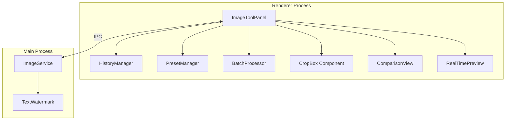
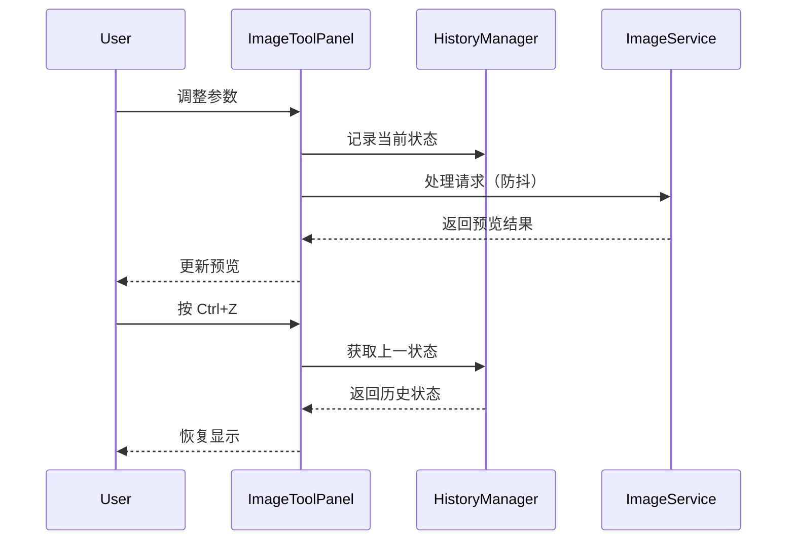

# Design Document: 图片工具优化扩展

## Overview

本设计文档描述图片处理工具的优化扩展实现方案。基于现有的 ImageToolPanel 和 ImageService 架构，增加可视化交互、实时预览、批量处理、处理历史等高级功能。设计遵循增量开发原则，确保新功能与现有代码无缝集成。

## Architecture

### 系统架构图



### 数据流



## Components and Interfaces

### 1. HistoryManager（处理历史管理器）

```typescript
interface HistoryState {
  id: string;
  timestamp: number;
  toolType: ImageToolType;
  options: ProcessOptions;
  previewUrl: string;
  result?: ProcessResult;
}

interface HistoryManager {
  // 状态
  history: HistoryState[];
  currentIndex: number;
  maxHistory: number; // 默认 20
  
  // 方法
  push(state: HistoryState): void;
  undo(): HistoryState | null;
  redo(): HistoryState | null;
  canUndo(): boolean;
  canRedo(): boolean;
  clear(): void;
}
```

### 2. PresetManager（预设管理器）

```typescript
interface Preset {
  id: string;
  name: string;
  description: string;
  category: 'builtin' | 'custom';
  toolType: ImageToolType;
  options: ProcessOptions;
}

interface PresetManager {
  // 内置预设
  builtinPresets: Preset[];
  
  // 自定义预设（存储在 localStorage）
  customPresets: Preset[];
  
  // 方法
  getPresets(toolType: ImageToolType): Preset[];
  applyPreset(preset: Preset): ProcessOptions;
  saveCustomPreset(name: string, options: ProcessOptions): Preset;
  deleteCustomPreset(id: string): void;
}
```

### 3. BatchProcessor（批量处理器）

```typescript
interface BatchItem {
  id: string;
  file: File;
  status: 'pending' | 'processing' | 'completed' | 'failed';
  progress: number;
  result?: ProcessResult;
  error?: string;
}

interface BatchProcessor {
  // 状态
  items: BatchItem[];
  isProcessing: boolean;
  
  // 方法
  addFiles(files: File[]): void;
  removeFile(id: string): void;
  processAll(options: ProcessOptions): Promise<void>;
  downloadAll(): Promise<void>;
  clear(): void;
}
```

### 4. CropBox（可视化裁剪框组件）

```typescript
interface CropBoxProps {
  imageWidth: number;
  imageHeight: number;
  displayWidth: number;
  displayHeight: number;
  cropArea: { left: number; top: number; width: number; height: number };
  onCropChange: (area: CropArea) => void;
  aspectRatio?: number; // 可选的固定宽高比
}

interface CropArea {
  left: number;
  top: number;
  width: number;
  height: number;
}
```

### 5. ComparisonView（对比视图组件）

```typescript
interface ComparisonViewProps {
  originalUrl: string;
  processedUrl: string;
  mode: 'horizontal' | 'vertical';
  sliderPosition: number; // 0-100
  onSliderChange: (position: number) => void;
}
```

### 6. TextWatermark（文字水印）

```typescript
interface TextWatermarkOptions {
  text: string;
  fontFamily: string;
  fontSize: number;
  color: string;
  opacity: number;
  position: WatermarkPosition;
  rotation?: number;
}

type WatermarkPosition = 
  | 'northwest' | 'north' | 'northeast'
  | 'west' | 'center' | 'east'
  | 'southwest' | 'south' | 'southeast';
```

### 7. RealTimePreview（实时预览）

```typescript
interface RealTimePreviewConfig {
  enabled: boolean;
  debounceMs: number; // 默认 300ms
  previewScale: number; // 预览缩放比例，默认 0.5
}
```

## Data Models

### 内置预设数据

```typescript
const BUILTIN_PRESETS: Preset[] = [
  // Web 优化
  {
    id: 'web-optimize',
    name: 'Web 优化',
    description: '适合网页使用，平衡质量和文件大小',
    category: 'builtin',
    toolType: 'compress',
    options: {
      format: 'webp',
      quality: 80,
      stripMetadata: true,
    },
  },
  // 社交媒体 - 微信朋友圈
  {
    id: 'wechat-moments',
    name: '微信朋友圈',
    description: '1080x1080 正方形',
    category: 'builtin',
    toolType: 'resize',
    options: {
      resize: { width: 1080, height: 1080, fit: 'cover' },
    },
  },
  // 社交媒体 - 微博
  {
    id: 'weibo',
    name: '微博配图',
    description: '1200x675 横版',
    category: 'builtin',
    toolType: 'resize',
    options: {
      resize: { width: 1200, height: 675, fit: 'cover' },
    },
  },
  // 头像裁剪
  {
    id: 'avatar-square',
    name: '方形头像',
    description: '200x200 正方形头像',
    category: 'builtin',
    toolType: 'crop',
    options: {
      resize: { width: 200, height: 200, fit: 'cover' },
    },
  },
  // 缩略图
  {
    id: 'thumbnail',
    name: '缩略图',
    description: '150x150 小图',
    category: 'builtin',
    toolType: 'resize',
    options: {
      resize: { width: 150, height: 150, fit: 'inside' },
    },
  },
];
```

### 快捷键映射

```typescript
const KEYBOARD_SHORTCUTS: Record<string, { key: string; ctrl?: boolean; shift?: boolean; action: string }> = {
  undo: { key: 'z', ctrl: true, action: 'undo' },
  redo: { key: 'y', ctrl: true, action: 'redo' },
  redoAlt: { key: 'z', ctrl: true, shift: true, action: 'redo' },
  save: { key: 's', ctrl: true, action: 'save' },
  reset: { key: 'Escape', action: 'reset' },
};
```

### 用户设置持久化

```typescript
interface UserSettings {
  realTimePreview: boolean;
  lastUsedTool: ImageToolType;
  toolSettings: Record<ImageToolType, Partial<ProcessOptions>>;
  customPresets: Preset[];
}

// 存储在 localStorage
const STORAGE_KEY = 'image-tool-settings';
```


## Correctness Properties

*A property is a characteristic or behavior that should hold true across all valid executions of a system—essentially, a formal statement about what the system should do. Properties serve as the bridge between human-readable specifications and machine-verifiable correctness guarantees.*

### Property 1: Crop Box Boundary Constraint

*For any* crop area configuration (left, top, width, height) and any image dimensions, the crop box SHALL always be constrained within the image boundaries such that:
- `left >= 0`
- `top >= 0`
- `left + width <= imageWidth`
- `top + height <= imageHeight`

**Validates: Requirements 1.6**

### Property 2: Crop Box State Synchronization

*For any* crop box state change (via drag or input), the visual representation and numeric values SHALL be synchronized such that:
- Dragging edges updates the corresponding dimension values
- Dragging center updates position values while maintaining size
- Changing input values updates the visual crop box position and size

**Validates: Requirements 1.2, 1.3, 1.4**

### Property 3: Debounce Prevents Excessive Requests

*For any* sequence of N rapid parameter changes within the debounce period (300ms), the system SHALL make at most 1 processing request after the debounce period expires.

**Validates: Requirements 2.3**

### Property 4: Preview Uses Lower Resolution

*For any* image with dimensions (W, H) where W > 800 or H > 800, the real-time preview SHALL use a scaled-down version with dimensions at most (800, 800) while maintaining aspect ratio.

**Validates: Requirements 2.4**

### Property 5: Comparison Slider Proportional Reveal

*For any* slider position P (0-100), the visible portion of the original image SHALL be approximately P% and the visible portion of the processed image SHALL be approximately (100-P)%.

**Validates: Requirements 3.2**

### Property 6: Batch Processing Applies Same Settings

*For any* batch of N images processed with options O, all N resulting images SHALL have been processed with the exact same options O.

**Validates: Requirements 4.2**

### Property 7: Batch Error Handling Continues Processing

*For any* batch containing both valid and invalid images, the batch processor SHALL:
- Successfully process all valid images
- Report errors for invalid images
- Not abort processing due to individual failures

**Validates: Requirements 4.5**

### Property 8: Text Watermark Rendering

*For any* text watermark configuration (text, position, font settings), the output image SHALL contain the specified text at the specified position with the specified styling. Multi-line text SHALL preserve line breaks.

**Validates: Requirements 5.1, 5.3, 5.5**

### Property 9: Preset Application Completeness

*For any* preset P with options O, applying the preset SHALL result in all options in O being applied to the current tool configuration.

**Validates: Requirements 6.2**

### Property 10: History Recording

*For any* processing operation, the history manager SHALL record the operation such that `history.length` increases by 1 (up to the maximum limit).

**Validates: Requirements 7.1**

### Property 11: History Undo/Redo Round-Trip

*For any* sequence of operations followed by undo, the state SHALL match the previous state. *For any* undo followed by redo, the state SHALL match the state before undo.

**Validates: Requirements 7.2, 7.3**

### Property 12: History Limit Enforcement

*For any* number of operations N, the history length SHALL never exceed 20 states.

**Validates: Requirements 7.5**

### Property 13: Settings Persistence

*For any* tool settings saved by the user, reloading the application SHALL restore those settings for the corresponding tool.

**Validates: Requirements 9.5**

## Error Handling

### 错误类型和处理策略

| 错误类型 | 处理策略 | 用户反馈 |
|---------|---------|---------|
| 文件上传失败 | 显示错误消息，允许重试 | "文件上传失败，请重试" |
| 图片处理失败 | 保持原图，显示错误详情 | "处理失败: [具体原因]" |
| 批量处理部分失败 | 继续处理其他图片，汇总报告 | "处理完成: X 成功, Y 失败" |
| 预设保存失败 | 显示错误，不影响当前操作 | "预设保存失败" |
| 历史记录溢出 | 自动删除最旧记录 | 无需提示 |
| 快捷键冲突 | 优先处理工具快捷键 | 无需提示 |

### 边界情况处理

1. **空图片列表**: 批量处理时显示提示，禁用处理按钮
2. **超大图片**: 实时预览自动降低分辨率，完整处理使用原图
3. **无效裁剪区域**: 自动约束到有效范围
4. **历史为空时撤销**: 禁用撤销按钮，忽略快捷键
5. **文字水印为空**: 禁用应用按钮，显示提示

## Testing Strategy

### 单元测试

使用 Jest 进行单元测试，覆盖以下场景：

1. **HistoryManager 测试**
   - 记录操作
   - 撤销/重做
   - 历史限制
   - 清空历史

2. **PresetManager 测试**
   - 加载内置预设
   - 保存/删除自定义预设
   - 应用预设

3. **CropBox 计算测试**
   - 边界约束计算
   - 拖拽位置计算
   - 宽高比锁定计算

4. **BatchProcessor 测试**
   - 添加/移除文件
   - 处理状态管理
   - 错误处理

### 属性测试

使用 fast-check 进行属性测试，每个属性测试运行至少 100 次迭代：

1. **Property 1**: 生成随机裁剪区域，验证边界约束
2. **Property 3**: 生成随机参数变化序列，验证防抖行为
3. **Property 6**: 生成随机图片批次和选项，验证一致性
4. **Property 10-12**: 生成随机操作序列，验证历史管理

### 集成测试

1. **端到端工作流测试**
   - 上传图片 → 调整参数 → 实时预览 → 保存
   - 批量上传 → 处理 → 下载 ZIP

2. **快捷键测试**
   - 验证所有快捷键正确触发对应操作

### 测试框架配置

```typescript
// jest.config.js 中已配置
// 属性测试使用 fast-check
import * as fc from 'fast-check';

// 示例属性测试
describe('HistoryManager Properties', () => {
  it('Property 12: history length never exceeds 20', () => {
    fc.assert(
      fc.property(
        fc.array(fc.record({ toolType: fc.string(), options: fc.object() }), { minLength: 0, maxLength: 50 }),
        (operations) => {
          const history = new HistoryManager();
          operations.forEach(op => history.push(op));
          return history.length <= 20;
        }
      ),
      { numRuns: 100 }
    );
  });
});
```

