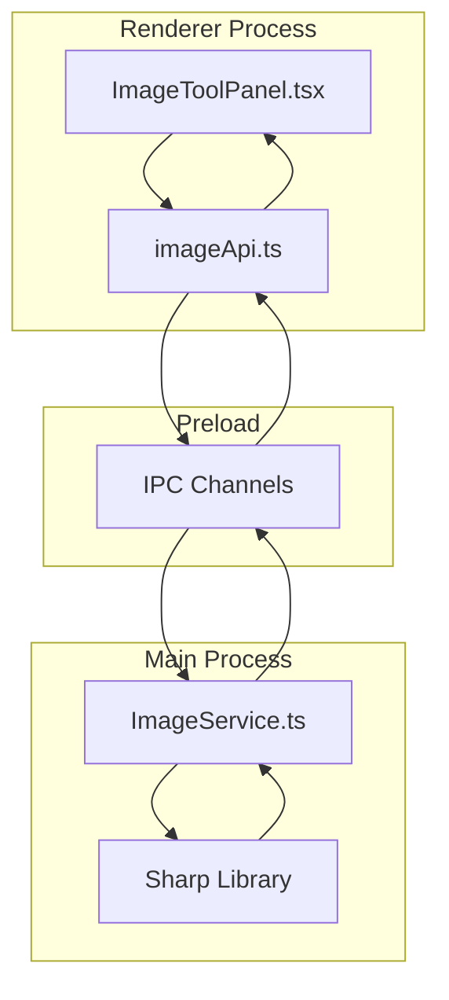

# Design Document: 图片处理工具

## Overview

本设计文档描述了在暮城笔记工具箱中集成图片处理功能的技术方案。该功能使用 Sharp 库在 Electron 主进程中处理图片，通过 IPC 通道与渲染进程通信，提供专业级的本地图片处理能力。

## Architecture



### 数据流

1. 用户在 ImageToolPanel 选择图片并配置处理参数
2. 渲染进程通过 imageApi 调用 IPC 通道
3. 主进程 ImageService 接收请求，使用 Sharp 处理图片
4. 处理结果（Buffer 或 Base64）返回给渲染进程
5. 渲染进程显示预览或触发下载

## Components and Interfaces

### 1. ImageService (主进程)

位置: `src/main/services/ImageService.ts`

```typescript
interface ImageMetadata {
  width: number;
  height: number;
  format: string;
  space: string;
  channels: number;
  depth: string;
  density?: number;
  hasAlpha: boolean;
  size: number;
  exif?: Record<string, any>;
  icc?: {
    name: string;
    description?: string;
  };
}

interface ProcessOptions {
  // 格式转换
  format?: 'jpeg' | 'png' | 'webp' | 'avif' | 'gif' | 'tiff';
  quality?: number;           // 1-100
  compressionLevel?: number;  // PNG: 0-9
  lossless?: boolean;         // WebP/AVIF
  progressive?: boolean;      // JPEG
  mozjpeg?: boolean;          // JPEG
  
  // 尺寸调整
  resize?: {
    width?: number;
    height?: number;
    fit?: 'cover' | 'contain' | 'fill' | 'inside' | 'outside';
    position?: string;
    background?: string;
    withoutEnlargement?: boolean;
  };
  
  // 扩展/裁边
  extend?: {
    top?: number;
    bottom?: number;
    left?: number;
    right?: number;
    background?: string;
  };
  trim?: boolean | { threshold?: number };
  
  // 裁剪
  extract?: {
    left: number;
    top: number;
    width: number;
    height: number;
  };
  
  // 旋转/翻转
  rotate?: number;
  flip?: boolean;      // 垂直翻转
  flop?: boolean;      // 水平翻转
  
  // 颜色处理
  grayscale?: boolean;
  tint?: string;       // 色调 RGB
  modulate?: {
    brightness?: number;  // 0.5-2
    saturation?: number;  // 0-2
    hue?: number;         // 0-360
  };
  
  // 滤镜
  blur?: number;       // sigma 0.3-100
  sharpen?: {
    sigma?: number;
    flat?: number;
    jagged?: number;
  };
  median?: number;     // 3-9
  gamma?: number;      // 0.1-3.0
  negate?: boolean;
  normalise?: boolean;
  
  // 合成
  composite?: Array<{
    input: Buffer | string;
    gravity?: string;
    top?: number;
    left?: number;
    blend?: string;
    opacity?: number;
  }>;
  
  // 元数据
  withMetadata?: boolean;
  stripMetadata?: boolean;
}

interface ProcessResult {
  buffer: Buffer;
  info: {
    format: string;
    width: number;
    height: number;
    size: number;
  };
}

class ImageService {
  // 获取图片元数据
  async getMetadata(input: Buffer | string): Promise<ImageMetadata>;
  
  // 处理图片
  async process(input: Buffer | string, options: ProcessOptions): Promise<ProcessResult>;
  
  // 批量处理
  async processBatch(inputs: Array<Buffer | string>, options: ProcessOptions): Promise<ProcessResult[]>;
  
  // 生成缩略图预览
  async generatePreview(input: Buffer | string, maxSize: number): Promise<Buffer>;
}
```

### 2. IPC 通道定义

位置: `src/main/preload.ts`

```typescript
// 新增 image API
image: {
  getMetadata: (input: string) => ipcRenderer.invoke('image:getMetadata', input),
  process: (input: string, options: ProcessOptions) => ipcRenderer.invoke('image:process', input, options),
  processBatch: (inputs: string[], options: ProcessOptions) => ipcRenderer.invoke('image:processBatch', inputs, options),
  generatePreview: (input: string, maxSize: number) => ipcRenderer.invoke('image:generatePreview', input, maxSize),
  saveFile: (buffer: string, defaultName: string) => ipcRenderer.invoke('image:saveFile', buffer, defaultName),
}
```

### 3. imageApi (渲染进程)

位置: `src/renderer/services/imageApi.ts`

```typescript
export const imageApi = {
  // 从文件路径或 Base64 获取元数据
  getMetadata: async (input: string): Promise<ImageMetadata> => {
    return window.electronAPI.image.getMetadata(input);
  },
  
  // 处理图片，返回 Base64
  process: async (input: string, options: ProcessOptions): Promise<ProcessResult> => {
    return window.electronAPI.image.process(input, options);
  },
  
  // 生成预览
  generatePreview: async (input: string, maxSize = 800): Promise<string> => {
    return window.electronAPI.image.generatePreview(input, maxSize);
  },
  
  // 保存文件（触发系统保存对话框）
  saveFile: async (base64: string, defaultName: string): Promise<boolean> => {
    return window.electronAPI.image.saveFile(base64, defaultName);
  },
};
```

### 4. ImageToolPanel (渲染进程)

位置: `src/renderer/components/ImageToolPanel.tsx`

```typescript
// 图片工具子类型
type ImageToolType = 
  | 'format-convert'    // 格式转换
  | 'resize'            // 尺寸调整
  | 'crop'              // 图片裁剪
  | 'rotate-flip'       // 旋转翻转
  | 'color-adjust'      // 颜色处理
  | 'filters'           // 滤镜效果
  | 'watermark'         // 合成叠加
  | 'metadata'          // 元数据
  | 'compress';         // 优化压缩

interface ImageToolPanelProps {
  // 无需外部 props，内部管理状态
}

// 组件结构
const ImageToolPanel: React.FC = () => {
  const [selectedTool, setSelectedTool] = useState<ImageToolType>('format-convert');
  const [imageFile, setImageFile] = useState<File | null>(null);
  const [imageData, setImageData] = useState<string | null>(null);  // Base64
  const [metadata, setMetadata] = useState<ImageMetadata | null>(null);
  const [processing, setProcessing] = useState(false);
  const [result, setResult] = useState<ProcessResult | null>(null);
  
  // 渲染对应工具界面
  const renderToolContent = () => {
    switch (selectedTool) {
      case 'format-convert': return <FormatConvertTool />;
      case 'resize': return <ResizeTool />;
      case 'crop': return <CropTool />;
      case 'rotate-flip': return <RotateFlipTool />;
      case 'color-adjust': return <ColorAdjustTool />;
      case 'filters': return <FiltersTool />;
      case 'watermark': return <WatermarkTool />;
      case 'metadata': return <MetadataTool />;
      case 'compress': return <CompressTool />;
    }
  };
};
```

## Data Models

### 图片处理配置存储

图片处理工具不需要持久化存储，所有配置都是临时的会话状态。但为了用户体验，可以在 localStorage 中保存用户的常用设置：

```typescript
interface ImageToolPreferences {
  defaultFormat: string;
  defaultQuality: number;
  defaultWatermarkPosition: string;
  recentColors: string[];
}

// 存储 key: 'image-tool-preferences'
```

## Correctness Properties

*A property is a characteristic or behavior that should hold true across all valid executions of a system-essentially, a formal statement about what the system should do. Properties serve as the bridge between human-readable specifications and machine-verifiable correctness guarantees.*

### Property 1: 格式转换往返一致性
*For any* valid image buffer and supported format, converting to that format and reading back should produce a valid image with correct format metadata.
**Validates: Requirements 1.1, 1.2**

### Property 2: 尺寸调整维度正确性
*For any* valid image and target dimensions (width, height), resizing with fit='fill' should produce an image with exactly those dimensions.
**Validates: Requirements 2.1**

### Property 3: 宽高比保持
*For any* valid image with aspect ratio R, resizing with keepAspectRatio=true should produce an image with aspect ratio within 0.01 of R.
**Validates: Requirements 2.2**

### Property 4: 裁剪区域正确性
*For any* valid image and valid crop region (left, top, width, height) within image bounds, the cropped output should have exactly (width, height) dimensions.
**Validates: Requirements 3.1**

### Property 5: 翻转往返一致性
*For any* valid image, applying flip twice (or flop twice) should produce an image identical to the original.
**Validates: Requirements 4.3, 4.4**

### Property 6: 旋转维度变换
*For any* valid image with dimensions (W, H), rotating by 90 or 270 degrees should produce an image with dimensions (H, W).
**Validates: Requirements 4.1**

### Property 7: 灰度转换一致性
*For any* valid color image, applying grayscale should produce an image where all pixels have equal R, G, B values (within tolerance for color space conversion).
**Validates: Requirements 5.5**

### Property 8: Gamma 1.0 恒等性
*For any* valid image, applying gamma correction with gamma=1.0 should produce an image visually identical to the original.
**Validates: Requirements 6.4**

### Property 9: 元数据剥离完整性
*For any* valid image with EXIF data, after stripping metadata, the output should have no EXIF data.
**Validates: Requirements 8.5**

### Property 10: 压缩文件大小减少
*For any* valid uncompressed image, compressing with quality < 100 should produce a file smaller than or equal to the original.
**Validates: Requirements 9.1, 9.2, 9.3**

## Error Handling

### 错误类型

```typescript
enum ImageErrorCode {
  INVALID_INPUT = 'INVALID_INPUT',           // 无效的输入文件
  UNSUPPORTED_FORMAT = 'UNSUPPORTED_FORMAT', // 不支持的格式
  PROCESSING_FAILED = 'PROCESSING_FAILED',   // 处理失败
  FILE_TOO_LARGE = 'FILE_TOO_LARGE',         // 文件过大
  INVALID_OPTIONS = 'INVALID_OPTIONS',       // 无效的处理选项
  SAVE_FAILED = 'SAVE_FAILED',               // 保存失败
}

interface ImageError {
  code: ImageErrorCode;
  message: string;
  details?: any;
}
```

### 错误处理策略

1. **输入验证**: 在处理前验证文件类型、大小、格式
2. **参数校验**: 验证处理选项的有效范围
3. **优雅降级**: 某些操作失败时返回原图
4. **用户提示**: 显示友好的中文错误信息

```typescript
const errorMessages: Record<ImageErrorCode, string> = {
  INVALID_INPUT: '无效的图片文件，请选择有效的图片',
  UNSUPPORTED_FORMAT: '不支持的图片格式',
  PROCESSING_FAILED: '图片处理失败，请重试',
  FILE_TOO_LARGE: '图片文件过大，请选择较小的图片（最大 50MB）',
  INVALID_OPTIONS: '处理参数无效',
  SAVE_FAILED: '保存文件失败',
};
```

## Testing Strategy

### 单元测试

使用 Jest 测试 ImageService 的核心功能：

1. **格式转换测试**: 测试各格式间的转换
2. **尺寸调整测试**: 测试各种 fit 模式
3. **裁剪测试**: 测试边界条件
4. **滤镜测试**: 测试参数范围
5. **错误处理测试**: 测试无效输入

### 属性测试

使用 fast-check 进行属性测试，验证上述 Correctness Properties：

```typescript
import fc from 'fast-check';

// Property 5: 翻转往返一致性
test('double flip should be identity', async () => {
  await fc.assert(
    fc.asyncProperty(
      fc.uint8Array({ minLength: 100, maxLength: 10000 }),
      async (imageData) => {
        // 创建测试图片
        const testImage = await createTestImage(imageData);
        
        // 双重翻转
        const flipped = await imageService.process(testImage, { flip: true });
        const doubleFlipped = await imageService.process(flipped.buffer, { flip: true });
        
        // 验证与原图相同
        return buffersEqual(testImage, doubleFlipped.buffer);
      }
    ),
    { numRuns: 100 }
  );
});
```

### 集成测试

测试完整的 IPC 通信流程和 UI 交互。

## UI 设计

### 工具箱集成

在 ToolboxPanel 中添加新的分类 "图片处理"：

```typescript
// 新增分类
type ToolCategory = 'text' | 'code' | 'convert' | 'image' | 'other';

// 图片工具列表
const imageTools: Tool[] = [
  { id: 'format-convert', name: '格式转换', icon: <SwapOutlined />, category: 'image' },
  { id: 'resize', name: '尺寸调整', icon: <ExpandOutlined />, category: 'image' },
  { id: 'crop', name: '图片裁剪', icon: <ScissorOutlined />, category: 'image' },
  { id: 'rotate-flip', name: '旋转翻转', icon: <RotateRightOutlined />, category: 'image' },
  { id: 'color-adjust', name: '颜色处理', icon: <BgColorsOutlined />, category: 'image' },
  { id: 'filters', name: '滤镜效果', icon: <FilterOutlined />, category: 'image' },
  { id: 'watermark', name: '水印叠加', icon: <PictureOutlined />, category: 'image' },
  { id: 'metadata', name: '元数据', icon: <InfoCircleOutlined />, category: 'image' },
  { id: 'compress', name: '优化压缩', icon: <CompressOutlined />, category: 'image' },
];
```

### 通用布局

每个图片工具采用统一的三栏布局：

```
+------------------+------------------------+------------------+
|                  |                        |                  |
|   图片上传区域    |      预览区域           |    参数配置区域   |
|   (拖拽/点击)    |   (原图/处理后对比)     |    (工具特定)    |
|                  |                        |                  |
+------------------+------------------------+------------------+
|                        操作按钮栏                             |
|              [处理] [重置] [下载] [复制]                       |
+--------------------------------------------------------------+
```
