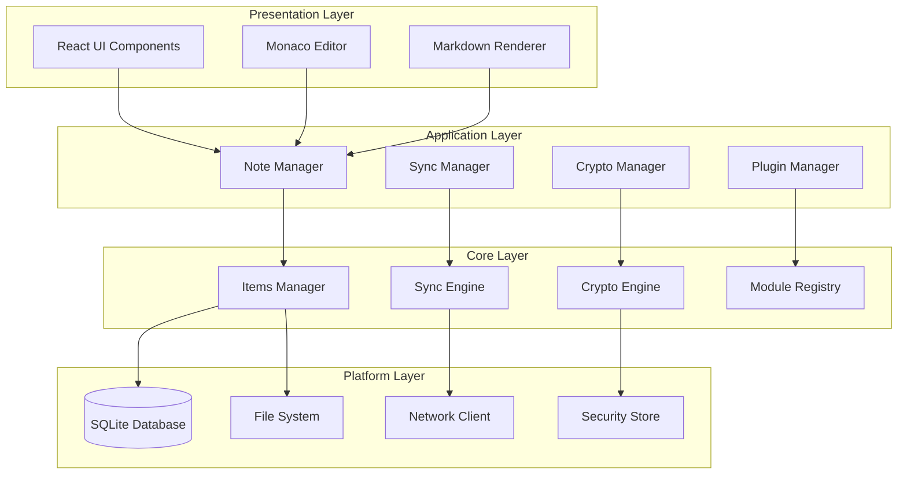

# Design Document

## Overview

暮城笔记采用现代化的技术架构，基于 Electron + React + TypeScript 构建跨平台桌面应用。系统采用分层设计，核心业务逻辑与平台适配分离，确保后续 Android 端开发时可以复用核心代码。

设计遵循"本地优先"原则，所有数据首先存储在本地 SQLite 数据库中，同步功能作为可选增强。采用统一的 Item 数据模型，简化数据管理和同步逻辑。

## Architecture

### 整体架构图



### 技术栈选型

#### 前端框架
- **Electron 28+**: 跨平台桌面应用框架
- **React 18**: 用户界面构建
- **TypeScript 5**: 类型安全的 JavaScript
- **Ant Design 5**: 企业级 UI 组件库

#### 编辑器和内容处理
- **Monaco Editor**: VS Code 同款编辑器，支持语法高亮
- **marked.js**: 高性能 Markdown 解析器
- **react-markdown**: React Markdown 渲染组件
- **highlight.js**: 代码语法高亮

#### 数据存储
- **better-sqlite3**: 高性能 SQLite Node.js 绑定
- **fs-extra**: 增强的文件系统操作
- **electron-store**: Electron 配置存储

#### 加密和安全
- **crypto-js**: JavaScript 加密库
- **node-forge**: TLS 和加密工具包
- **keytar**: 系统密钥库访问

#### 网络和同步
- **axios**: HTTP 客户端
- **webdav**: WebDAV 客户端库
- **retry**: 智能重试机制

#### 工具库
- **lodash**: 实用工具函数
- **date-fns**: 现代化日期处理
- **uuid**: UUID 生成器
- **mime-types**: MIME 类型检测

## Components and Interfaces

### 核心组件设计

#### 1. Items Manager (统一数据管理)

```typescript
interface ItemBase {
  id: string;              // UUID
  type: ItemType;          // 数据类型枚举
  created_time: number;    // 创建时间 (Unix timestamp)
  updated_time: number;    // 更新时间
  deleted_time?: number;   // 软删除时间
  payload: any;            // 业务数据 (JSON)
  content_hash: string;    // SHA-256 内容哈希
  sync_status: SyncStatus; // 同步状态
  local_rev: number;       // 本地版本号
  remote_rev?: string;     // 远端版本标识
  encryption_applied: boolean; // 是否加密
  schema_version: number;  // Schema 版本
}

class ItemsManager {
  private db: Database;
  private cryptoEngine: CryptoEngine;
  
  async createItem(type: ItemType, payload: any): Promise<ItemBase> {
    const item: ItemBase = {
      id: uuidv4(),
      type,
      created_time: Date.now(),
      updated_time: Date.now(),
      payload: JSON.stringify(payload),
      content_hash: this.calculateHash(payload),
      sync_status: SyncStatus.MODIFIED,
      local_rev: 1,
      encryption_applied: false,
      schema_version: 1
    };
    
    // 如果启用加密，加密 payload
    if (this.shouldEncrypt(type)) {
      item.payload = await this.cryptoEngine.encrypt(item.payload);
      item.encryption_applied = true;
    }
    
    return this.db.prepare(`
      INSERT INTO items VALUES (?, ?, ?, ?, ?, ?, ?, ?, ?, ?, ?, ?)
    `).run(...Object.values(item));
  }
  
  async getItem(id: string): Promise<ItemBase | null> {
    const item = this.db.prepare('SELECT * FROM items WHERE id = ?').get(id);
    if (!item) return null;
    
    // 解密 payload（如果需要）
    if (item.encryption_applied) {
      item.payload = await this.cryptoEngine.decrypt(item.payload);
    }
    
    return item;
  }
  
  async updateItem(id: string, payload: any): Promise<ItemBase> {
    const existingItem = await this.getItem(id);
    if (!existingItem) throw new Error('Item not found');
    
    const updatedItem = {
      ...existingItem,
      payload: JSON.stringify(payload),
      updated_time: Date.now(),
      content_hash: this.calculateHash(payload),
      sync_status: SyncStatus.MODIFIED,
      local_rev: existingItem.local_rev + 1
    };
    
    // 重新加密（如果需要）
    if (this.shouldEncrypt(existingItem.type)) {
      updatedItem.payload = await this.cryptoEngine.encrypt(updatedItem.payload);
      updatedItem.encryption_applied = true;
    }
    
    this.db.prepare(`
      UPDATE items SET payload = ?, updated_time = ?, content_hash = ?, 
                      sync_status = ?, local_rev = ? WHERE id = ?
    `).run(updatedItem.payload, updatedItem.updated_time, updatedItem.content_hash,
           updatedItem.sync_status, updatedItem.local_rev, id);
    
    return updatedItem;
  }
  
  private calculateHash(payload: any): string {
    return crypto.createHash('sha256').update(JSON.stringify(payload)).digest('hex');
  }
  
  private shouldEncrypt(type: ItemType): boolean {
    // 根据用户设置和数据类型决定是否加密
    return this.cryptoEngine.isEncryptionEnabled() && 
           this.cryptoEngine.shouldEncryptType(type);
  }
}
```

#### 2. Sync Engine (同步引擎)

```typescript
interface StorageAdapter {
  listChanges(cursor?: string, limit?: number): Promise<ChangeItem[]>;
  getItem(id: string): Promise<ItemBase | null>;
  putItem(item: ItemBase): Promise<void>;
  getResource(id: string): Promise<Buffer>;
  putResource(id: string, data: Buffer): Promise<void>;
  getRemoteMeta(): Promise<RemoteMeta>;
}

class WebDAVAdapter implements StorageAdapter {
  private client: WebDAVClient;
  
  constructor(config: WebDAVConfig) {
    this.client = createClient(config.url, {
      username: config.username,
      password: config.password
    });
  }
  
  async listChanges(cursor?: string, limit = 100): Promise<ChangeItem[]> {
    // 读取远端变更日志
    const changesPath = '/changes/changes.log';
    
    try {
      const content = await this.client.getFileContents(changesPath, { format: 'text' });
      const lines = content.toString().split('\n');
      
      // 解析变更记录
      const changes: ChangeItem[] = [];
      for (const line of lines) {
        if (!line.trim()) continue;
        
        const change = JSON.parse(line);
        if (!cursor || change.id > cursor) {
          changes.push(change);
        }
        
        if (changes.length >= limit) break;
      }
      
      return changes;
    } catch (error) {
      if (error.status === 404) {
        return []; // 首次同步，无变更日志
      }
      throw error;
    }
  }
  
  async putItem(item: ItemBase): Promise<void> {
    const itemPath = `/items/${item.type}/${item.id}.json`;
    const itemData = JSON.stringify(item, null, 2);
    
    await this.client.putFileContents(itemPath, itemData);
    
    // 记录变更到日志
    await this.appendChangeLog({
      id: uuidv4(),
      item_id: item.id,
      type: item.type,
      action: item.deleted_time ? 'delete' : 'upsert',
      timestamp: Date.now()
    });
  }
  
  private async appendChangeLog(change: ChangeItem): Promise<void> {
    const changesPath = '/changes/changes.log';
    const changeRecord = JSON.stringify(change) + '\n';
    
    try {
      // 追加到现有日志
      const existingContent = await this.client.getFileContents(changesPath, { format: 'text' });
      const newContent = existingContent.toString() + changeRecord;
      await this.client.putFileContents(changesPath, newContent);
    } catch (error) {
      if (error.status === 404) {
        // 创建新的变更日志
        await this.client.putFileContents(changesPath, changeRecord);
      } else {
        throw error;
      }
    }
  }
}

class SyncEngine {
  private itemsManager: ItemsManager;
  private storageAdapter: StorageAdapter;
  private syncLocked = false;
  
  async sync(): Promise<SyncResult> {
    if (this.syncLocked) {
      return { status: 'LOCKED', message: '同步已锁定' };
    }
    
    try {
      // 检查同步密钥兼容性
      const keyCheck = await this.checkKeyCompatibility();
      if (!keyCheck.compatible) {
        this.syncLocked = true;
        return {
          status: 'KEY_CONFLICT',
          message: '同步密钥不匹配，已锁定同步',
          localCount: keyCheck.localCount,
          remoteCount: keyCheck.remoteCount
        };
      }
      
      // 执行三阶段同步
      await this.pushLocalChanges();
      await this.pullRemoteChanges();
      await this.commitSync();
      
      return { status: 'SUCCESS', message: '同步完成' };
    } catch (error) {
      return { status: 'ERROR', message: error.message };
    }
  }
  
  private async pushLocalChanges(): Promise<void> {
    const localChanges = await this.itemsManager.getModifiedItems();
    
    for (const item of localChanges) {
      await this.storageAdapter.putItem(item);
      
      // 更新本地状态
      await this.itemsManager.markAsSynced(item.id);
    }
  }
  
  private async pullRemoteChanges(): Promise<void> {
    const lastCursor = await this.getLastSyncCursor();
    const remoteChanges = await this.storageAdapter.listChanges(lastCursor);
    
    for (const change of remoteChanges) {
      const remoteItem = await this.storageAdapter.getItem(change.item_id);
      if (!remoteItem) continue;
      
      await this.applyRemoteChange(remoteItem);
    }
    
    // 更新同步游标
    if (remoteChanges.length > 0) {
      const lastChange = remoteChanges[remoteChanges.length - 1];
      await this.updateSyncCursor(lastChange.id);
    }
  }
  
  private async applyRemoteChange(remoteItem: ItemBase): Promise<void> {
    const localItem = await this.itemsManager.getItem(remoteItem.id);
    
    if (!localItem) {
      // 新增项目
      await this.itemsManager.insertRemoteItem(remoteItem);
    } else if (localItem.sync_status === SyncStatus.MODIFIED) {
      // 冲突处理：创建冲突副本
      await this.createConflictCopy(localItem);
      await this.itemsManager.replaceWithRemote(remoteItem);
    } else {
      // 正常更新
      await this.itemsManager.replaceWithRemote(remoteItem);
    }
  }
}
```

#### 3. Crypto Engine (加密引擎)

```typescript
class CryptoEngine {
  private syncKey: string | null = null;
  private encryptionEnabled = false;
  
  async generateSyncKey(): Promise<string> {
    const key = crypto.randomBytes(32).toString('base64');
    await this.storeSyncKey(key);
    return key;
  }
  
  async setSyncKey(key: string): Promise<void> {
    // 验证密钥格式
    if (!this.isValidSyncKey(key)) {
      throw new Error('Invalid sync key format');
    }
    
    this.syncKey = key;
    await this.storeSyncKey(key);
  }
  
  async encrypt(plaintext: string): Promise<string> {
    if (!this.syncKey) {
      throw new Error('No sync key available');
    }
    
    // 生成随机 IV 和盐值
    const salt = crypto.randomBytes(32);
    const iv = crypto.randomBytes(12);
    
    // 派生数据密钥
    const dataKey = await this.deriveDataKey(this.syncKey, 'note', 'v1');
    
    // AES-256-GCM 加密
    const cipher = crypto.createCipher('aes-256-gcm', dataKey, iv);
    const ciphertext = Buffer.concat([
      cipher.update(plaintext, 'utf8'),
      cipher.final()
    ]);
    const authTag = cipher.getAuthTag();
    
    // 统一格式封装
    const encryptedData = {
      version: '2.0',
      algorithm: 'AES-256-GCM',
      key_derivation: {
        method: 'HKDF-SHA256',
        purpose: 'note',
        context: 'v1',
        sync_key_version: '1.0'
      },
      salt: salt.toString('base64'),
      iv: iv.toString('base64'),
      ciphertext: ciphertext.toString('base64'),
      auth_tag: authTag.toString('base64')
    };
    
    return JSON.stringify(encryptedData);
  }
  
  async decrypt(encryptedData: string): Promise<string> {
    const data = JSON.parse(encryptedData);
    
    if (data.version === '2.0' && data.algorithm === 'AES-256-GCM') {
      const salt = Buffer.from(data.salt, 'base64');
      const iv = Buffer.from(data.iv, 'base64');
      const ciphertext = Buffer.from(data.ciphertext, 'base64');
      const authTag = Buffer.from(data.auth_tag, 'base64');
      
      // 重新派生相同密钥
      const dataKey = await this.deriveDataKey(
        this.syncKey!,
        data.key_derivation.purpose,
        data.key_derivation.context
      );
      
      // 解密验证
      const decipher = crypto.createDecipher('aes-256-gcm', dataKey, iv);
      decipher.setAuthTag(authTag);
      
      const plaintext = Buffer.concat([
        decipher.update(ciphertext),
        decipher.final()
      ]);
      
      return plaintext.toString('utf8');
    }
    
    throw new Error(`Unsupported encryption version: ${data.version}`);
  }
  
  private async deriveDataKey(syncKey: string, purpose: string, context: string): Promise<Buffer> {
    const info = `mucheng-notes-${purpose}-${context}`;
    const inputKey = Buffer.from(syncKey, 'base64');
    
    // 使用 HKDF-SHA256 派生
    return crypto.hkdf('sha256', inputKey, Buffer.alloc(0), info, 32);
  }
  
  private async storeSyncKey(key: string): Promise<void> {
    // 使用系统密钥库安全存储
    await keytar.setPassword('mucheng-notes', 'sync-key', key);
  }
  
  private async loadSyncKey(): Promise<string | null> {
    return await keytar.getPassword('mucheng-notes', 'sync-key');
  }
}
```

## Data Models

### SQLite Schema 设计

```sql
-- 主表：统一存储所有同步对象
CREATE TABLE items (
    id TEXT PRIMARY KEY,
    type TEXT NOT NULL,
    created_time INTEGER NOT NULL,
    updated_time INTEGER NOT NULL,
    deleted_time INTEGER,
    payload TEXT NOT NULL,
    content_hash TEXT NOT NULL,
    sync_status TEXT DEFAULT 'clean',
    local_rev INTEGER DEFAULT 1,
    remote_rev TEXT,
    encryption_applied INTEGER DEFAULT 0,
    schema_version INTEGER DEFAULT 1
);

-- 索引优化
CREATE INDEX idx_items_type ON items(type);
CREATE INDEX idx_items_updated_time ON items(updated_time);
CREATE INDEX idx_items_sync_status ON items(sync_status);
CREATE INDEX idx_items_deleted_time ON items(deleted_time);

-- 全文搜索表 (FTS5)
CREATE VIRTUAL TABLE items_fts USING fts5(
    id UNINDEXED,
    title,
    content,
    content='items',
    content_rowid='rowid'
);

-- 同步元数据表
CREATE TABLE sync_meta (
    key TEXT PRIMARY KEY,
    value TEXT
);

-- 插入默认同步元数据
INSERT INTO sync_meta (key, value) VALUES 
    ('sync_cursor', '0'),
    ('last_sync_time', '0'),
    ('sync_enabled', 'false'),
    ('encryption_enabled', 'false');
```

### 业务数据模型

#### 笔记 (Note) Payload
```typescript
interface NotePayload {
  title: string;
  content: string;           // Markdown 内容
  folder_id?: string;        // 所属文件夹 ID
  tag_ids: string[];         // 关联标签 ID 列表
  is_pinned: boolean;        // 是否置顶
  password_protected: boolean; // 是否有独立密码保护
  password_hash?: string;    // 独立密码哈希
  attachments: string[];     // 附件资源 ID 列表
  links: string[];           // 笔记链接 ID 列表
  created_by: string;        // 创建设备标识
  modified_by: string;       // 最后修改设备标识
}
```

#### 文件夹 (Folder) Payload
```typescript
interface FolderPayload {
  name: string;
  parent_id?: string;        // 父文件夹 ID
  color?: string;            // 文件夹颜色
  icon?: string;             // 文件夹图标
  sort_order: number;        // 排序顺序
  expanded: boolean;         // 是否展开（UI 状态）
}
```

#### 标签 (Tag) Payload
```typescript
interface TagPayload {
  name: string;
  color: string;             // 标签颜色
  description?: string;      // 标签描述
  usage_count: number;       // 使用次数（统计）
}
```

#### 资源 (Resource) Payload
```typescript
interface ResourcePayload {
  filename: string;
  original_name: string;     // 原始文件名
  mime_type: string;
  size: number;              // 文件大小（字节）
  file_path: string;         // 本地文件路径
  checksum: string;          // 文件校验和
  thumbnail_path?: string;   // 缩略图路径（图片）
  ocr_text?: string;         // OCR 提取的文本（图片）
}
```

#### 模板 (Template) Payload
```typescript
interface TemplatePayload {
  name: string;
  description?: string;
  content: string;           // 模板内容
  variables: TemplateVariable[]; // 模板变量定义
  category: string;          // 模板分类
  is_system: boolean;        // 是否系统模板
}

interface TemplateVariable {
  name: string;
  type: 'text' | 'date' | 'number';
  default_value?: string;
  description?: string;
}
```

#### 配置 (Config) Payload
```typescript
interface ConfigPayload {
  section: string;           // 配置分组
  settings: Record<string, any>; // 配置项
  platform_specific: boolean; // 是否平台特定
  sync_enabled: boolean;     // 是否同步此配置
}
```

## 开源组件集成策略

### UI 组件集成

#### Ant Design 集成
```typescript
// 主题定制
import { ConfigProvider, theme } from 'antd';

const App: React.FC = () => {
  const [isDarkMode, setIsDarkMode] = useState(false);
  
  return (
    <ConfigProvider
      theme={{
        algorithm: isDarkMode ? theme.darkAlgorithm : theme.defaultAlgorithm,
        token: {
          colorPrimary: '#1890ff',
          borderRadius: 6,
          fontSize: 14,
        },
      }}
    >
      <Layout>
        <MainContent />
      </Layout>
    </ConfigProvider>
  );
};

// 组件使用示例
import { Layout, Menu, Input, Button, List, Card } from 'antd';
const { Sider, Content } = Layout;
const { Search } = Input;

const NoteList: React.FC = () => {
  return (
    <List
      dataSource={notes}
      renderItem={(note) => (
        <List.Item>
          <Card
            title={note.title}
            extra={<Button type="link">编辑</Button>}
            size="small"
          >
            {note.preview}
          </Card>
        </List.Item>
      )}
    />
  );
};
```

#### Monaco Editor 集成
```typescript
import MonacoEditor from '@monaco-editor/react';

const MarkdownEditor: React.FC<{ value: string; onChange: (value: string) => void }> = ({
  value,
  onChange
}) => {
  const handleEditorDidMount = (editor: any, monaco: any) => {
    // 自定义 Markdown 语法高亮
    monaco.languages.setMonarchTokensProvider('markdown', {
      tokenizer: {
        root: [
          [/^#{1,6}\s.*$/, 'markup.heading'],
          [/\*\*.*?\*\*/, 'markup.bold'],
          [/\*.*?\*/, 'markup.italic'],
          [/`.*?`/, 'markup.inline.raw'],
          [/\[\[.*?\]\]/, 'markup.link'], // 笔记链接
        ]
      }
    });
    
    // 自定义快捷键
    editor.addCommand(monaco.KeyMod.CtrlCmd | monaco.KeyCode.KeyS, () => {
      // 保存笔记
      onSave();
    });
  };
  
  return (
    <MonacoEditor
      height="100%"
      language="markdown"
      theme="vs-dark"
      value={value}
      onChange={onChange}
      onMount={handleEditorDidMount}
      options={{
        minimap: { enabled: false },
        wordWrap: 'on',
        lineNumbers: 'off',
        folding: false,
        fontSize: 14,
        fontFamily: 'Consolas, Monaco, monospace',
      }}
    />
  );
};
```

### Markdown 处理集成

```typescript
import { marked } from 'marked';
import hljs from 'highlight.js';

// 配置 marked
marked.setOptions({
  highlight: (code, lang) => {
    if (lang && hljs.getLanguage(lang)) {
      return hljs.highlight(code, { language: lang }).value;
    }
    return hljs.highlightAuto(code).value;
  },
  breaks: true,
  gfm: true,
});

// 自定义渲染器
const renderer = new marked.Renderer();

// 处理笔记链接 [[笔记标题]]
renderer.text = (text) => {
  return text.replace(/\[\[(.*?)\]\]/g, (match, title) => {
    const noteId = findNoteByTitle(title);
    if (noteId) {
      return `<a href="#" data-note-id="${noteId}" class="note-link">${title}</a>`;
    }
    return `<span class="note-link-broken">${title}</span>`;
  });
};

// 处理图片
renderer.image = (href, title, text) => {
  // 处理本地图片路径
  if (href.startsWith('resource://')) {
    const resourceId = href.replace('resource://', '');
    const localPath = getResourcePath(resourceId);
    return ``;
  }
  return ``;
};

marked.use({ renderer });

// Markdown 渲染组件
const MarkdownRenderer: React.FC<{ content: string }> = ({ content }) => {
  const htmlContent = marked(content);
  
  return (
    <div 
      className="markdown-content"
      dangerouslySetInnerHTML={{ __html: htmlContent }}
      onClick={handleLinkClick}
    />
  );
};
```

### 数据库集成

```typescript
import Database from 'better-sqlite3';
import path from 'path';
import { app } from 'electron';

class DatabaseManager {
  private db: Database.Database;
  
  constructor() {
    const dbPath = path.join(app.getPath('userData'), 'mucheng-notes.db');
    this.db = new Database(dbPath);
    this.initializeSchema();
  }
  
  private initializeSchema(): void {
    // 创建表结构
    this.db.exec(`
      CREATE TABLE IF NOT EXISTS items (
        id TEXT PRIMARY KEY,
        type TEXT NOT NULL,
        created_time INTEGER NOT NULL,
        updated_time INTEGER NOT NULL,
        deleted_time INTEGER,
        payload TEXT NOT NULL,
        content_hash TEXT NOT NULL,
        sync_status TEXT DEFAULT 'clean',
        local_rev INTEGER DEFAULT 1,
        remote_rev TEXT,
        encryption_applied INTEGER DEFAULT 0,
        schema_version INTEGER DEFAULT 1
      );
      
      CREATE INDEX IF NOT EXISTS idx_items_type ON items(type);
      CREATE INDEX IF NOT EXISTS idx_items_updated_time ON items(updated_time);
      CREATE INDEX IF NOT EXISTS idx_items_sync_status ON items(sync_status);
      
      CREATE VIRTUAL TABLE IF NOT EXISTS items_fts USING fts5(
        id UNINDEXED,
        title,
        content,
        content='items',
        content_rowid='rowid'
      );
      
      CREATE TABLE IF NOT EXISTS sync_meta (
        key TEXT PRIMARY KEY,
        value TEXT
      );
    `);
    
    // 初始化默认数据
    const insertMeta = this.db.prepare(`
      INSERT OR IGNORE INTO sync_meta (key, value) VALUES (?, ?)
    `);
    
    insertMeta.run('sync_cursor', '0');
    insertMeta.run('last_sync_time', '0');
    insertMeta.run('sync_enabled', 'false');
    insertMeta.run('encryption_enabled', 'false');
  }
  
  // 预编译语句提高性能
  private statements = {
    insertItem: this.db.prepare(`
      INSERT INTO items VALUES (?, ?, ?, ?, ?, ?, ?, ?, ?, ?, ?, ?)
    `),
    updateItem: this.db.prepare(`
      UPDATE items SET payload = ?, updated_time = ?, content_hash = ?, 
                      sync_status = ?, local_rev = ? WHERE id = ?
    `),
    getItem: this.db.prepare('SELECT * FROM items WHERE id = ?'),
    getItemsByType: this.db.prepare('SELECT * FROM items WHERE type = ? AND deleted_time IS NULL'),
    searchItems: this.db.prepare(`
      SELECT items.* FROM items_fts 
      JOIN items ON items.rowid = items_fts.rowid 
      WHERE items_fts MATCH ? AND items.deleted_time IS NULL
    `),
  };
  
  insertItem(item: ItemBase): void {
    this.statements.insertItem.run(...Object.values(item));
  }
  
  updateItem(id: string, updates: Partial<ItemBase>): void {
    this.statements.updateItem.run(
      updates.payload,
      updates.updated_time,
      updates.content_hash,
      updates.sync_status,
      updates.local_rev,
      id
    );
  }
  
  getItem(id: string): ItemBase | null {
    return this.statements.getItem.get(id) as ItemBase | null;
  }
  
  searchItems(query: string): ItemBase[] {
    return this.statements.searchItems.all(query) as ItemBase[];
  }
  
  close(): void {
    this.db.close();
  }
}
```

### 网络同步集成

```typescript
import { createClient } from 'webdav';
import axios from 'axios';
import retry from 'retry';

class NetworkManager {
  private webdavClient: any;
  private axiosInstance: any;
  
  constructor() {
    // 配置 axios 实例
    this.axiosInstance = axios.create({
      timeout: 30000,
      headers: {
        'User-Agent': 'MuchengNotes/1.0'
      }
    });
    
    // 请求重试配置
    this.axiosInstance.interceptors.response.use(
      (response) => response,
      (error) => {
        if (this.shouldRetry(error)) {
          return this.retryRequest(error.config);
        }
        return Promise.reject(error);
      }
    );
  }
  
  setupWebDAV(config: WebDAVConfig): void {
    this.webdavClient = createClient(config.url, {
      username: config.username,
      password: config.password,
      headers: {
        'User-Agent': 'MuchengNotes/1.0'
      }
    });
  }
  
  private shouldRetry(error: any): boolean {
    return error.code === 'ECONNRESET' || 
           error.code === 'ETIMEDOUT' ||
           (error.response && error.response.status >= 500);
  }
  
  private retryRequest(config: any): Promise<any> {
    return new Promise((resolve, reject) => {
      const operation = retry.operation({
        retries: 3,
        factor: 2,
        minTimeout: 1000,
        maxTimeout: 5000,
      });
      
      operation.attempt(() => {
        this.axiosInstance(config)
          .then(resolve)
          .catch((error: any) => {
            if (operation.retry(error)) {
              return;
            }
            reject(operation.mainError());
          });
      });
    });
  }
  
  async uploadFile(path: string, data: Buffer | string): Promise<void> {
    if (!this.webdavClient) {
      throw new Error('WebDAV client not configured');
    }
    
    await this.webdavClient.putFileContents(path, data);
  }
  
  async downloadFile(path: string): Promise<Buffer> {
    if (!this.webdavClient) {
      throw new Error('WebDAV client not configured');
    }
    
    return await this.webdavClient.getFileContents(path, { format: 'binary' });
  }
  
  async listDirectory(path: string): Promise<any[]> {
    if (!this.webdavClient) {
      throw new Error('WebDAV client not configured');
    }
    
    return await this.webdavClient.getDirectoryContents(path);
  }
}
```

### 测试集成

```typescript
import fc from 'fast-check';

// 属性测试示例
describe('ItemsManager Property Tests', () => {
  test('创建然后获取笔记应该返回相同内容', () => {
    fc.assert(fc.property(
      fc.record({
        title: fc.string({ minLength: 1, maxLength: 100 }),
        content: fc.string({ maxLength: 10000 }),
        tags: fc.array(fc.string(), { maxLength: 10 })
      }),
      async (noteData) => {
        const itemsManager = new ItemsManager();
        
        // 创建笔记
        const createdItem = await itemsManager.createItem('note', noteData);
        
        // 获取笔记
        const retrievedItem = await itemsManager.getItem(createdItem.id);
        
        // 验证内容一致性
        expect(retrievedItem).not.toBeNull();
        expect(JSON.parse(retrievedItem!.payload)).toEqual(noteData);
        expect(retrievedItem!.type).toBe('note');
      }
    ));
  });
  
  test('加密然后解密应该返回原始内容', () => {
    fc.assert(fc.property(
      fc.string({ minLength: 1, maxLength: 1000 }),
      fc.string({ minLength: 32, maxLength: 32 }).map(s => Buffer.from(s).toString('base64')),
      async (plaintext, syncKey) => {
        const cryptoEngine = new CryptoEngine();
        await cryptoEngine.setSyncKey(syncKey);
        
        // 加密
        const encrypted = await cryptoEngine.encrypt(plaintext);
        
        // 解密
        const decrypted = await cryptoEngine.decrypt(encrypted);
        
        // 验证一致性
        expect(decrypted).toBe(plaintext);
      }
    ));
  });
});
```

这个设计文档详细规划了如何利用各种开源组件来加速开发，同时保持代码的质量和可维护性。每个组件的集成都有具体的代码示例和最佳实践。
## Correctness Properties

*A property is a characteristic or behavior that should hold true across all valid executions of a system-essentially, a formal statement about what the system should do. Properties serve as the bridge between human-readable specifications and machine-verifiable correctness guarantees.*

### Property-Based Testing Overview

Property-based testing (PBT) validates software correctness by testing universal properties across many generated inputs. Each property is a formal specification that should hold for all valid inputs.

### Core Correctness Properties

#### Property 1: 笔记创建唯一性和持久化
*For any* valid note data, creating a note should generate a unique ID and persist the data to the database such that retrieving the note returns the same content.
**Validates: Requirements 1.1**

#### Property 2: Markdown处理一致性  
*For any* valid Markdown content, the system should consistently parse and render the content while preserving the original semantic meaning.
**Validates: Requirements 1.2**

#### Property 3: 软删除数据完整性
*For any* existing note, deleting it should set the deleted_time field while keeping the note data intact in the database.
**Validates: Requirements 1.3**

#### Property 4: 搜索结果相关性
*For any* search query and existing notes, all returned results should contain the search terms and no relevant notes should be omitted.
**Validates: Requirements 1.4**

#### Property 5: 置顶笔记排序优先级
*For any* collection of notes with some marked as pinned, the pinned notes should always appear before non-pinned notes in the list.
**Validates: Requirements 1.5**

#### Property 6: 统一数据模型存储
*For any* data object of any supported type, storing it should use the unified Item model structure with all required fields properly populated.
**Validates: Requirements 3.2**

#### Property 7: 条件查询准确性
*For any* query conditions (type, time, status), the returned results should exactly match the specified criteria with no false positives or negatives.
**Validates: Requirements 3.3**

#### Property 8: WebDAV配置验证
*For any* WebDAV configuration parameters, the system should correctly validate the connection and save valid configurations while rejecting invalid ones.
**Validates: Requirements 5.1**

#### Property 9: 三阶段同步执行顺序
*For any* sync operation, the system should execute Push, Pull, and Commit phases in the correct order without skipping or reordering phases.
**Validates: Requirements 5.2**

#### Property 10: 本地变更检测准确性
*For any* modified or deleted items, the change detection should identify exactly those items with sync_status of 'modified' or 'deleted'.
**Validates: Requirements 6.1**

#### Property 11: 同步冲突处理完整性
*For any* item that has been modified both locally and remotely, the system should create a conflict copy of the local version and apply the remote version to maintain consistency.
**Validates: Requirements 7.1, 7.2**

#### Property 12: 加密标准合规性
*For any* data to be encrypted, the system should use AES-256-GCM algorithm with PBKDF2 key derivation and produce a standardized JSON format containing all necessary cryptographic metadata.
**Validates: Requirements 8.1, 27.1, 27.2**

#### Property 13: 明文同步透明性
*For any* data when plaintext sync is selected, the payload should be transmitted without encryption and remain readable in its original format.
**Validates: Requirements 8.2**

#### Property 14: 混合数据处理一致性
*For any* collection of items with mixed encryption states, the system should process each item according to its encryption_applied flag without cross-contamination.
**Validates: Requirements 8.7**

#### Property 15: 同步密钥安全拒绝
*For any* sync attempt with mismatched keys, the system should completely reject the operation and preserve all local data without any modifications.
**Validates: Requirements 28.5**

#### Property 16: 备份完整性往返
*For any* system state with data and settings, creating a backup and then restoring from it should reproduce the exact same system state.
**Validates: Requirements 16.1, 16.4**

#### Property 17: 笔记链接语法解析
*For any* text content containing [[note title]] syntax, the system should correctly identify and convert these to functional note links.
**Validates: Requirements 22.1**

#### Property 18: 链接引用更新一致性
*For any* note that is referenced by other notes, renaming the note should automatically update all link references to maintain link integrity.
**Validates: Requirements 22.4**

#### Property 19: 版本控制往返一致性
*For any* note modification sequence, creating version snapshots and then restoring to any previous version should reproduce the exact content of that version.
**Validates: Requirements 23.1, 23.3**

### Example-Based Test Cases

#### Example 1: 应用启动数据库初始化
When the application starts for the first time, it should successfully initialize the SQLite database with all required tables and indexes.
**Validates: Requirements 3.1**

#### Example 2: 首次同步无密钥验证
When syncing to an empty remote server, the system should proceed with the sync without requiring key validation.
**Validates: Requirements 28.4**

#### Example 3: 主题设置持久化
When a user selects a theme and restarts the application, the selected theme should be preserved and applied.
**Validates: Requirements 11.2**

#### Example 4: 启动时自动同步检查
When the application starts, it should automatically trigger a sync check if sync is enabled.
**Validates: Requirements 12.1**

## Error Handling

### 错误分类和处理策略

#### 1. 数据库错误
- **SQLite连接失败**: 重试连接，失败后提示用户检查文件权限
- **数据库损坏**: 尝试修复，失败后从备份恢复
- **磁盘空间不足**: 提示用户清理空间或更改数据库位置
- **事务冲突**: 自动重试，超过限制后回滚并报错

```typescript
class DatabaseErrorHandler {
  async handleError(error: DatabaseError): Promise<void> {
    switch (error.type) {
      case 'CONNECTION_FAILED':
        await this.retryConnection(error);
        break;
      case 'CORRUPTION_DETECTED':
        await this.attemptRepair(error);
        break;
      case 'DISK_FULL':
        await this.handleDiskFull(error);
        break;
      case 'TRANSACTION_CONFLICT':
        await this.retryTransaction(error);
        break;
      default:
        await this.logAndReport(error);
    }
  }
}
```

#### 2. 同步错误
- **网络连接失败**: 指数退避重试，离线模式队列
- **认证失败**: 提示用户重新输入凭据
- **服务器错误**: 记录错误，延迟重试
- **密钥不匹配**: 锁定同步，要求用户干预

```typescript
class SyncErrorHandler {
  async handleSyncError(error: SyncError): Promise<SyncResult> {
    switch (error.type) {
      case 'NETWORK_FAILURE':
        return await this.handleNetworkFailure(error);
      case 'AUTH_FAILURE':
        return await this.handleAuthFailure(error);
      case 'KEY_MISMATCH':
        return await this.handleKeyMismatch(error);
      case 'SERVER_ERROR':
        return await this.handleServerError(error);
      default:
        return { status: 'ERROR', message: error.message };
    }
  }
  
  private async handleNetworkFailure(error: SyncError): Promise<SyncResult> {
    // 指数退避重试
    const retryDelays = [1000, 2000, 4000, 8000, 16000]; // ms
    
    for (const delay of retryDelays) {
      await this.sleep(delay);
      
      try {
        return await this.attemptSync();
      } catch (retryError) {
        continue;
      }
    }
    
    // 所有重试失败，切换到离线模式
    await this.enableOfflineMode();
    return { status: 'OFFLINE', message: '网络不可用，已切换到离线模式' };
  }
}
```

#### 3. 加密错误
- **密钥丢失**: 提示用户从备份恢复密钥
- **解密失败**: 验证密钥正确性，提示重新输入
- **加密算法不支持**: 提示升级应用或使用兼容格式
- **数据完整性验证失败**: 警告用户数据可能被篡改

```typescript
class CryptoErrorHandler {
  async handleCryptoError(error: CryptoError): Promise<void> {
    switch (error.type) {
      case 'KEY_NOT_FOUND':
        await this.promptKeyRecovery();
        break;
      case 'DECRYPTION_FAILED':
        await this.verifyAndPromptKey();
        break;
      case 'UNSUPPORTED_ALGORITHM':
        await this.handleUnsupportedAlgorithm(error);
        break;
      case 'INTEGRITY_CHECK_FAILED':
        await this.handleIntegrityFailure(error);
        break;
    }
  }
  
  private async handleIntegrityFailure(error: CryptoError): Promise<void> {
    // 数据完整性失败是严重安全问题
    await this.logSecurityEvent(error);
    
    // 隔离可疑数据
    await this.quarantineCorruptedData(error.itemId);
    
    // 警告用户
    await this.showSecurityWarning({
      title: '数据完整性警告',
      message: '检测到数据可能被篡改，已隔离相关数据。请检查同步服务器安全性。',
      severity: 'HIGH'
    });
  }
}
```

#### 4. 文件系统错误
- **文件权限不足**: 提示用户授予权限或更改位置
- **文件不存在**: 尝试从备份恢复或重新创建
- **磁盘IO错误**: 检查磁盘健康状态，建议备份数据
- **路径过长**: 自动缩短路径或提示用户更改位置

#### 5. 内存和性能错误
- **内存不足**: 释放缓存，分批处理大数据
- **处理超时**: 增加超时时间或分解任务
- **CPU使用过高**: 降低处理优先级，添加延迟
- **大文件处理**: 启用流式处理和分块上传

### 错误恢复机制

#### 1. 自动恢复
```typescript
class AutoRecoveryManager {
  async attemptAutoRecovery(error: SystemError): Promise<boolean> {
    const recoveryStrategies = [
      this.clearCache,
      this.restartServices,
      this.repairDatabase,
      this.restoreFromBackup
    ];
    
    for (const strategy of recoveryStrategies) {
      try {
        await strategy();
        
        // 验证恢复是否成功
        if (await this.verifySystemHealth()) {
          await this.logRecoverySuccess(strategy.name);
          return true;
        }
      } catch (recoveryError) {
        await this.logRecoveryFailure(strategy.name, recoveryError);
        continue;
      }
    }
    
    return false; // 自动恢复失败
  }
}
```

#### 2. 用户引导恢复
```typescript
interface RecoveryOption {
  title: string;
  description: string;
  action: () => Promise<void>;
  risk: 'LOW' | 'MEDIUM' | 'HIGH';
  dataLoss: boolean;
}

class UserGuidedRecovery {
  async presentRecoveryOptions(error: SystemError): Promise<void> {
    const options: RecoveryOption[] = [
      {
        title: '重启应用',
        description: '关闭并重新启动应用程序',
        action: this.restartApplication,
        risk: 'LOW',
        dataLoss: false
      },
      {
        title: '清理缓存',
        description: '清除临时文件和缓存数据',
        action: this.clearAllCaches,
        risk: 'LOW',
        dataLoss: false
      },
      {
        title: '修复数据库',
        description: '尝试修复数据库文件',
        action: this.repairDatabase,
        risk: 'MEDIUM',
        dataLoss: false
      },
      {
        title: '从备份恢复',
        description: '从最近的备份恢复数据',
        action: this.restoreFromBackup,
        risk: 'HIGH',
        dataLoss: true
      }
    ];
    
    await this.showRecoveryDialog(options);
  }
}
```

## Testing Strategy

### 双重测试方法

本系统采用单元测试和属性测试相结合的综合测试策略：

- **单元测试**: 验证特定示例、边界情况和错误条件
- **属性测试**: 验证跨所有输入的通用属性
- **集成测试**: 验证组件间交互和端到端流程

### 属性测试配置

#### 测试框架选择
- **Jest**: 主测试框架
- **fast-check**: 属性测试库
- **@testing-library/react**: React组件测试

#### 测试配置要求
- 每个属性测试最少运行 **100 次迭代**
- 每个属性测试必须引用对应的设计文档属性
- 标签格式: **Feature: mucheng-notes, Property {number}: {property_text}**

#### 属性测试示例

```typescript
import fc from 'fast-check';

describe('Mucheng Notes Property Tests', () => {
  // Feature: mucheng-notes, Property 1: 笔记创建唯一性和持久化
  test('Property 1: Note creation uniqueness and persistence', () => {
    fc.assert(fc.property(
      fc.record({
        title: fc.string({ minLength: 1, maxLength: 200 }),
        content: fc.string({ maxLength: 50000 }),
        tags: fc.array(fc.string({ minLength: 1, maxLength: 50 }), { maxLength: 20 })
      }),
      async (noteData) => {
        const itemsManager = new ItemsManager();
        
        // 创建笔记
        const note1 = await itemsManager.createItem('note', noteData);
        const note2 = await itemsManager.createItem('note', noteData);
        
        // 验证ID唯一性
        expect(note1.id).not.toBe(note2.id);
        
        // 验证数据持久化
        const retrieved = await itemsManager.getItem(note1.id);
        expect(retrieved).not.toBeNull();
        expect(JSON.parse(retrieved!.payload)).toEqual(noteData);
      }
    ), { numRuns: 100 });
  });
  
  // Feature: mucheng-notes, Property 12: 加密标准合规性
  test('Property 12: Encryption standard compliance', () => {
    fc.assert(fc.property(
      fc.string({ minLength: 1, maxLength: 10000 }),
      fc.string({ minLength: 44, maxLength: 44 }), // Base64 32-byte key
      async (plaintext, syncKey) => {
        const cryptoEngine = new CryptoEngine();
        await cryptoEngine.setSyncKey(syncKey);
        
        // 加密数据
        const encrypted = await cryptoEngine.encrypt(plaintext);
        const encryptedData = JSON.parse(encrypted);
        
        // 验证格式合规性
        expect(encryptedData.version).toBe('2.0');
        expect(encryptedData.algorithm).toBe('AES-256-GCM');
        expect(encryptedData.key_derivation.method).toBe('HKDF-SHA256');
        
        // 验证必需字段存在
        expect(encryptedData.salt).toBeDefined();
        expect(encryptedData.iv).toBeDefined();
        expect(encryptedData.ciphertext).toBeDefined();
        expect(encryptedData.auth_tag).toBeDefined();
        
        // 验证往返一致性
        const decrypted = await cryptoEngine.decrypt(encrypted);
        expect(decrypted).toBe(plaintext);
      }
    ), { numRuns: 100 });
  });
  
  // Feature: mucheng-notes, Property 16: 备份完整性往返
  test('Property 16: Backup integrity round-trip', () => {
    fc.assert(fc.property(
      fc.array(fc.record({
        type: fc.constantFrom('note', 'folder', 'tag'),
        payload: fc.object()
      }), { minLength: 1, maxLength: 50 }),
      async (items) => {
        const backupManager = new BackupManager();
        const itemsManager = new ItemsManager();
        
        // 创建测试数据
        for (const item of items) {
          await itemsManager.createItem(item.type as ItemType, item.payload);
        }
        
        // 创建备份
        const backupFile = await backupManager.createBackup();
        
        // 清空数据
        await itemsManager.clearAllData();
        
        // 从备份恢复
        await backupManager.restoreFromBackup(backupFile);
        
        // 验证数据完整性
        const restoredItems = await itemsManager.getAllItems();
        expect(restoredItems).toHaveLength(items.length);
        
        // 验证每个项目都被正确恢复
        for (const originalItem of items) {
          const restored = restoredItems.find(r => 
            r.type === originalItem.type && 
            JSON.stringify(JSON.parse(r.payload)) === JSON.stringify(originalItem.payload)
          );
          expect(restored).toBeDefined();
        }
      }
    ), { numRuns: 100 });
  });
});
```

### 单元测试策略

```typescript
describe('Mucheng Notes Unit Tests', () => {
  describe('Database Initialization', () => {
    test('should initialize database on first startup', async () => {
      const dbManager = new DatabaseManager();
      await dbManager.initialize();
      
      // 验证表结构
      const tables = await dbManager.getTables();
      expect(tables).toContain('items');
      expect(tables).toContain('sync_meta');
      expect(tables).toContain('items_fts');
    });
  });
  
  describe('Sync Key Security', () => {
    test('should reject sync when keys mismatch', async () => {
      const syncEngine = new SyncEngine();
      
      // 模拟密钥不匹配情况
      await syncEngine.setLocalKey('key1');
      mockRemoteData([{ id: '1', encryption_applied: true, payload: 'encrypted_with_key2' }]);
      
      const result = await syncEngine.sync();
      
      expect(result.status).toBe('KEY_CONFLICT');
      expect(result.message).toContain('密钥不匹配');
      
      // 验证没有数据被修改
      const localData = await syncEngine.getLocalData();
      expect(localData).toHaveLength(0); // 应该没有被远端数据覆盖
    });
  });
  
  describe('Error Handling', () => {
    test('should handle database corruption gracefully', async () => {
      const dbManager = new DatabaseManager();
      
      // 模拟数据库损坏
      jest.spyOn(dbManager, 'query').mockRejectedValue(new Error('database disk image is malformed'));
      
      const errorHandler = new DatabaseErrorHandler();
      await errorHandler.handleError({ type: 'CORRUPTION_DETECTED', originalError: new Error() });
      
      // 验证恢复尝试被触发
      expect(dbManager.attemptRepair).toHaveBeenCalled();
    });
  });
});
```

### 集成测试

```typescript
describe('End-to-End Integration Tests', () => {
  test('complete note lifecycle with sync', async () => {
    // 设置测试环境
    const app = new MuchengNotesApp();
    await app.initialize();
    
    // 创建笔记
    const note = await app.createNote({
      title: 'Test Note',
      content: '# Hello World\n\nThis is a test note.'
    });
    
    // 编辑笔记
    await app.updateNote(note.id, {
      content: '# Hello World\n\nThis is an updated test note.'
    });
    
    // 启用同步
    await app.enableSync({
      type: 'webdav',
      url: 'https://test-webdav.example.com',
      username: 'test',
      password: 'test'
    });
    
    // 执行同步
    const syncResult = await app.sync();
    expect(syncResult.status).toBe('SUCCESS');
    
    // 验证远端数据
    const remoteNote = await app.getRemoteNote(note.id);
    expect(remoteNote.content).toContain('updated test note');
    
    // 清理
    await app.cleanup();
  });
});
```

这个设计文档现在包含了完整的架构设计、组件接口、数据模型、正确性属性和测试策略，为实现阶段提供了详细的技术指导。