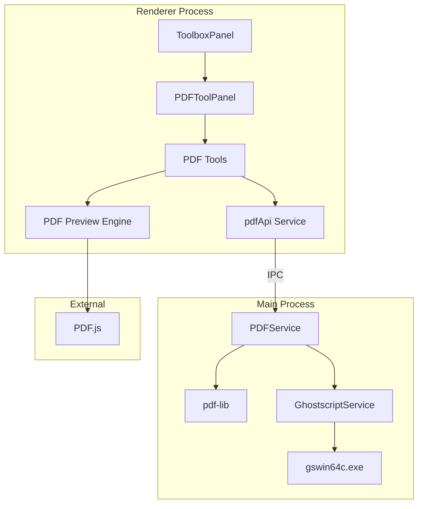

# Design Document: PDF 工具套件

## Overview

PDF 工具套件是暮城笔记工具箱的新增分类，提供完整的 PDF 文件处理能力。采用三层架构设计：
- **渲染层**：PDF.js 负责预览和缩略图渲染
- **编辑层**：pdf-lib 负责 PDF 结构操作（合并、拆分、水印、旋转等）
- **转换层**：Ghostscript 负责格式转换和压缩

技术栈选择基于以下考虑：
- PDF.js：Chrome 同源，兼容性强，支持缩放/搜索/分页
- pdf-lib：纯 JS 实现，无系统依赖，可在 Electron 主进程运行
- Ghostscript：工业级 PDF 引擎，支持高质量转换和压缩

## Architecture



### UI 布局规范

所有 PDF 工具组件采用统一的上下布局结构：

```
┌─────────────────────────────────────────┐
│  参数设置区（紧凑布局）                    │
│  - 文件上传                              │
│  - 操作选项（使用 Row/Col 或 Space 紧凑排列）│
│  - 操作按钮                              │
├─────────────────────────────────────────┤
│  预览区                                  │
│  - PDF 预览 / 缩略图网格                  │
│  - 处理结果展示                          │
│  - 下载按钮                              │
└─────────────────────────────────────────┘
```

**布局原则：**
1. 参数设置在上，预览在下（垂直布局）
2. 参数区使用 Card 组件，size="small"，紧凑排列
3. 多个选项使用 Row/Col 或 Space 水平排列，减少垂直空间占用
4. 预览区自适应剩余高度
5. 复用 ImageToolPanel 的布局模式

### 进程分工

| 功能 | 进程 | 技术 |
|------|------|------|
| PDF 预览/缩略图 | Renderer | PDF.js |
| PDF 编辑操作 | Main | pdf-lib |
| PDF 转换/压缩 | Main | Ghostscript |
| 图片后处理 | Main | Sharp (复用) |

## Components and Interfaces

### 1. PDFToolPanel 组件

主容器组件，管理所有 PDF 工具的切换和状态。

```typescript
interface PDFToolPanelProps {
  defaultTool?: PDFToolType;
  hideSidebar?: boolean;
}

type PDFToolType = 
  | 'preview'        // PDF 预览
  | 'merge-split'    // 合并拆分
  | 'to-image'       // 转图片
  | 'compress'       // 压缩
  | 'watermark'      // 加水印
  | 'rotate'         // 旋转调整
  | 'reorder'        // 页面重排
  | 'delete-pages'   // 页面删除
  | 'extract-pages'  // 页面提取
  | 'rename'         // 批量重命名
  | 'form-fill'      // 表单填写
  | 'security'       // 安全加密
  | 'metadata'       // 元数据编辑
  | 'image-to-pdf'   // 图片转PDF
  | 'compare';       // PDF对比
```

### 2. PDF Preview Engine

基于 PDF.js 的预览引擎，提供统一的预览能力。

```typescript
interface PDFPreviewProps {
  pdfData: ArrayBuffer | string;  // PDF 数据或 URL
  currentPage: number;
  zoom: number;
  onPageChange: (page: number) => void;
  onTotalPagesChange: (total: number) => void;
}

interface PDFThumbnailsProps {
  pdfData: ArrayBuffer | string;
  selectedPages: number[];
  onPageSelect: (pages: number[]) => void;
  onPageReorder?: (newOrder: number[]) => void;
  draggable?: boolean;
  showDeleteButton?: boolean;
  onPageDelete?: (page: number) => void;
}
```

### 3. pdfApi Service (Renderer)

渲染进程的 PDF API 服务，通过 IPC 与主进程通信。

```typescript
// src/renderer/services/pdfApi.ts

export interface MergeOptions {
  files: ArrayBuffer[];
  pageSelections?: { fileIndex: number; pages: number[] }[];
}

export interface SplitOptions {
  file: ArrayBuffer;
  ranges: string;  // e.g., "1-3,5,7-10"
}

export interface ToImageOptions {
  file: ArrayBuffer;
  pages: number[];
  format: 'png' | 'jpg';
  dpi: number;
}

export interface CompressOptions {
  file: ArrayBuffer;
  level: 'low' | 'medium' | 'high';
}

export interface WatermarkOptions {
  file: ArrayBuffer;
  type: 'text' | 'image';
  text?: string;
  imageData?: ArrayBuffer;
  fontSize?: number;
  color?: string;
  opacity: number;
  rotation: number;
  position: 'center' | 'tile' | { x: number; y: number };
  pages?: number[];  // undefined = all pages
}

export interface RotateOptions {
  file: ArrayBuffer;
  pages: number[];
  angle: 90 | -90 | 180;
}

export interface ReorderOptions {
  file: ArrayBuffer;
  newOrder: number[];  // [3, 1, 2] means page 3 becomes page 1
}

export interface DeletePagesOptions {
  file: ArrayBuffer;
  pages: number[];
}

export interface ExtractPagesOptions {
  file: ArrayBuffer;
  pages: number[];
}

export interface SecurityOptions {
  file: ArrayBuffer;
  userPassword?: string;
  ownerPassword?: string;
  permissions?: {
    printing: boolean;
    copying: boolean;
    modifying: boolean;
  };
}

export interface MetadataOptions {
  file: ArrayBuffer;
  title?: string;
  author?: string;
  subject?: string;
  keywords?: string;
}

export interface ImageToPdfOptions {
  images: ArrayBuffer[];
  pageSize: 'fit' | 'a4' | 'letter';
  placement: 'center' | 'stretch' | 'fit';
}

export const pdfApi = {
  // 获取 PDF 信息
  getInfo: (file: ArrayBuffer): Promise<PDFInfo>,
  
  // 合并 PDF
  merge: (options: MergeOptions): Promise<ArrayBuffer>,
  
  // 拆分 PDF
  split: (options: SplitOptions): Promise<ArrayBuffer[]>,
  
  // 转图片
  toImage: (options: ToImageOptions): Promise<ArrayBuffer[]>,
  
  // 压缩
  compress: (options: CompressOptions): Promise<{ data: ArrayBuffer; ratio: number }>,
  
  // 加水印
  addWatermark: (options: WatermarkOptions): Promise<ArrayBuffer>,
  
  // 旋转
  rotate: (options: RotateOptions): Promise<ArrayBuffer>,
  
  // 重排页面
  reorder: (options: ReorderOptions): Promise<ArrayBuffer>,
  
  // 删除页面
  deletePages: (options: DeletePagesOptions): Promise<ArrayBuffer>,
  
  // 提取页面
  extractPages: (options: ExtractPagesOptions): Promise<ArrayBuffer>,
  
  // 安全设置
  setSecurity: (options: SecurityOptions): Promise<ArrayBuffer>,
  removeSecurity: (file: ArrayBuffer, password: string): Promise<ArrayBuffer>,
  
  // 元数据
  getMetadata: (file: ArrayBuffer): Promise<PDFMetadata>,
  setMetadata: (options: MetadataOptions): Promise<ArrayBuffer>,
  
  // 图片转 PDF
  imagesToPdf: (options: ImageToPdfOptions): Promise<ArrayBuffer>,
  
  // 表单操作
  getFormFields: (file: ArrayBuffer): Promise<FormField[]>,
  fillForm: (file: ArrayBuffer, values: Record<string, any>): Promise<ArrayBuffer>,
};
```

### 4. PDFService (Main Process)

主进程的 PDF 服务，实现实际的 PDF 操作。

```typescript
// src/main/services/PDFService.ts

import { PDFDocument, rgb, degrees } from 'pdf-lib';
import { GhostscriptService } from './GhostscriptService';

export class PDFService {
  private gs: GhostscriptService;
  
  constructor() {
    this.gs = new GhostscriptService();
  }
  
  // pdf-lib 操作
  async merge(files: Buffer[], pageSelections?: PageSelection[]): Promise<Buffer>;
  async split(file: Buffer, ranges: string): Promise<Buffer[]>;
  async addWatermark(file: Buffer, options: WatermarkOptions): Promise<Buffer>;
  async rotate(file: Buffer, pages: number[], angle: number): Promise<Buffer>;
  async reorder(file: Buffer, newOrder: number[]): Promise<Buffer>;
  async deletePages(file: Buffer, pages: number[]): Promise<Buffer>;
  async extractPages(file: Buffer, pages: number[]): Promise<Buffer>;
  async setSecurity(file: Buffer, options: SecurityOptions): Promise<Buffer>;
  async setMetadata(file: Buffer, metadata: PDFMetadata): Promise<Buffer>;
  async imagesToPdf(images: Buffer[], options: ImageToPdfOptions): Promise<Buffer>;
  async getFormFields(file: Buffer): Promise<FormField[]>;
  async fillForm(file: Buffer, values: Record<string, any>): Promise<Buffer>;
  
  // Ghostscript 操作
  async toImage(file: Buffer, pages: number[], format: string, dpi: number): Promise<Buffer[]>;
  async compress(file: Buffer, level: string): Promise<{ data: Buffer; ratio: number }>;
}
```

### 5. GhostscriptService

Ghostscript 调用服务，封装命令行操作。

```typescript
// src/main/services/GhostscriptService.ts

import { spawn } from 'child_process';
import * as path from 'path';
import * as fs from 'fs';
import * as os from 'os';

export class GhostscriptService {
  private gsPath: string;
  
  constructor() {
    // 根据平台确定 Ghostscript 路径
    if (process.platform === 'win32') {
      this.gsPath = path.join(process.resourcesPath, 'gs', 'gswin64c.exe');
    } else if (process.platform === 'darwin') {
      this.gsPath = path.join(process.resourcesPath, 'gs', 'gs');
    } else {
      this.gsPath = 'gs';  // Linux 使用系统安装的 gs
    }
  }
  
  async toImage(
    inputPath: string,
    outputDir: string,
    format: 'png' | 'jpg',
    dpi: number,
    pages?: number[]
  ): Promise<string[]> {
    const device = format === 'png' ? 'png16m' : 'jpeg';
    const ext = format === 'png' ? 'png' : 'jpg';
    const outputPattern = path.join(outputDir, `page_%03d.${ext}`);
    
    const args = [
      '-dNOPAUSE',
      '-dBATCH',
      '-dSAFER',
      `-sDEVICE=${device}`,
      `-r${dpi}`,
      `-sOutputFile=${outputPattern}`,
    ];
    
    if (pages && pages.length > 0) {
      args.push(`-dFirstPage=${Math.min(...pages)}`);
      args.push(`-dLastPage=${Math.max(...pages)}`);
    }
    
    args.push(inputPath);
    
    await this.execute(args);
    
    // 返回生成的文件列表
    return this.getOutputFiles(outputDir, ext);
  }
  
  async compress(
    inputPath: string,
    outputPath: string,
    level: 'low' | 'medium' | 'high'
  ): Promise<void> {
    const settings = {
      low: '/prepress',      // 高质量，较大文件
      medium: '/ebook',      // 中等质量
      high: '/screen',       // 低质量，最小文件
    };
    
    const args = [
      '-dNOPAUSE',
      '-dBATCH',
      '-dSAFER',
      '-sDEVICE=pdfwrite',
      `-dPDFSETTINGS=${settings[level]}`,
      '-dCompatibilityLevel=1.4',
      `-sOutputFile=${outputPath}`,
      inputPath,
    ];
    
    await this.execute(args);
  }
  
  private execute(args: string[]): Promise<void> {
    return new Promise((resolve, reject) => {
      const process = spawn(this.gsPath, args);
      
      let stderr = '';
      process.stderr.on('data', (data) => {
        stderr += data.toString();
      });
      
      process.on('close', (code) => {
        if (code === 0) {
          resolve();
        } else {
          reject(new Error(`Ghostscript failed: ${stderr}`));
        }
      });
      
      process.on('error', (err) => {
        reject(new Error(`Failed to start Ghostscript: ${err.message}`));
      });
    });
  }
  
  private getOutputFiles(dir: string, ext: string): string[] {
    const files = fs.readdirSync(dir);
    return files
      .filter(f => f.endsWith(`.${ext}`))
      .sort()
      .map(f => path.join(dir, f));
  }
}
```

## Data Models

### PDF 信息

```typescript
interface PDFInfo {
  pageCount: number;
  title?: string;
  author?: string;
  subject?: string;
  keywords?: string;
  creator?: string;
  producer?: string;
  creationDate?: Date;
  modificationDate?: Date;
  isEncrypted: boolean;
  hasFormFields: boolean;
}
```

### 页面范围解析

```typescript
// 解析页面范围字符串，如 "1-3,5,7-10"
function parsePageRanges(rangeStr: string, totalPages: number): number[] {
  const pages: Set<number> = new Set();
  const parts = rangeStr.split(',').map(s => s.trim());
  
  for (const part of parts) {
    if (part.includes('-')) {
      const [start, end] = part.split('-').map(Number);
      for (let i = start; i <= end && i <= totalPages; i++) {
        if (i >= 1) pages.add(i);
      }
    } else {
      const page = Number(part);
      if (page >= 1 && page <= totalPages) {
        pages.add(page);
      }
    }
  }
  
  return Array.from(pages).sort((a, b) => a - b);
}
```

### 表单字段

```typescript
interface FormField {
  name: string;
  type: 'text' | 'checkbox' | 'radio' | 'dropdown' | 'button';
  value: any;
  options?: string[];  // for dropdown/radio
  page: number;
  rect: { x: number; y: number; width: number; height: number };
}
```

## Correctness Properties

*A property is a characteristic or behavior that should hold true across all valid executions of a system—essentially, a formal statement about what the system should do. Properties serve as the bridge between human-readable specifications and machine-verifiable correctness guarantees.*

### Property 1: PDF Merge Preserves Page Content

*For any* set of valid PDF files and any page selection, merging them should produce a valid PDF where the total page count equals the sum of selected pages, and each page's content is preserved.

**Validates: Requirements 2.4, 2.5**

### Property 2: PDF Split Produces Correct Subsets

*For any* valid PDF and any valid page range specification, splitting should produce PDF files where each contains exactly the specified pages in order.

**Validates: Requirements 2.5, 2.6**

### Property 3: Page Range Parsing Correctness

*For any* valid page range string (e.g., "1-3,5,7-10") and total page count, parsing should return exactly the specified pages in ascending order, with no duplicates and no out-of-range pages.

**Validates: Requirements 2.6, 8.4, 14.4**

### Property 4: PDF to Image Conversion Produces Valid Images

*For any* valid PDF page, any supported format (PNG/JPG), and any DPI setting, conversion should produce a valid image file with dimensions proportional to the page size and DPI.

**Validates: Requirements 3.5**

### Property 5: PDF Compression Reduces or Maintains Size

*For any* valid PDF and any compression level, the compressed output should be a valid PDF with file size less than or equal to the original.

**Validates: Requirements 4.4, 4.5**

### Property 6: Watermark Application Preserves Page Count

*For any* valid PDF and any watermark configuration, applying the watermark should produce a valid PDF with the same page count, where each specified page contains the watermark.

**Validates: Requirements 5.6, 5.7**

### Property 7: Page Rotation Correctness

*For any* valid PDF page and any rotation angle (90°, -90°, 180°), rotating should produce a page with dimensions swapped (for 90°/-90°) or unchanged (for 180°), with content rotated accordingly.

**Validates: Requirements 6.5**

### Property 8: Page Reorder Produces Correct Sequence

*For any* valid PDF and any valid page order permutation, reordering should produce a PDF where pages appear in the specified order, with all content preserved.

**Validates: Requirements 7.4, 7.5**

### Property 9: Page Deletion Reduces Page Count

*For any* valid PDF with N pages and any selection of M pages (where M < N), deleting should produce a PDF with exactly N-M pages, containing only the non-deleted pages in their original order.

**Validates: Requirements 8.5**

### Property 10: Filename Template Substitution

*For any* filename template with placeholders and any set of values, substitution should produce a valid filename with all placeholders replaced correctly.

**Validates: Requirements 9.4, 9.5, 9.6**

### Property 11: PDF Preview Navigation Bounds

*For any* valid PDF with N pages, navigation should keep the current page within [1, N], and zoom should keep the level within the allowed range.

**Validates: Requirements 11.2, 11.3, 13.5**

### Property 12: File Type Validation

*For any* file input, the system should accept only valid PDF files (by magic bytes, not just extension) and reject all others with appropriate error messages.

**Validates: Requirements 12.5**

### Property 13: Form Field Round-Trip

*For any* PDF with form fields and any valid field values, filling the form and then reading the values should return the same values that were set.

**Validates: Requirements 16.2, 16.3, 16.4, 16.5**

### Property 14: PDF Encryption Round-Trip

*For any* valid PDF and any password, encrypting with a password and then decrypting with the same password should produce a PDF equivalent to the original.

**Validates: Requirements 17.2, 17.3, 17.5, 17.7**

### Property 15: Metadata Round-Trip

*For any* valid PDF and any metadata values, setting metadata and then reading it should return the same values that were set.

**Validates: Requirements 18.2, 18.4**

### Property 16: Image to PDF Page Count

*For any* set of N valid images, converting to PDF should produce a PDF with exactly N pages, one image per page.

**Validates: Requirements 19.6**

### Property 17: Comparison View Synchronization

*For any* two PDFs in comparison view, any navigation or zoom action should be applied to both views simultaneously, keeping them in sync.

**Validates: Requirements 20.3, 20.4**

## Error Handling

### 错误类型

```typescript
enum PDFErrorCode {
  INVALID_FILE = 'INVALID_FILE',           // 无效的 PDF 文件
  CORRUPTED_FILE = 'CORRUPTED_FILE',       // 损坏的 PDF 文件
  PASSWORD_REQUIRED = 'PASSWORD_REQUIRED', // 需要密码
  WRONG_PASSWORD = 'WRONG_PASSWORD',       // 密码错误
  GHOSTSCRIPT_NOT_FOUND = 'GS_NOT_FOUND',  // Ghostscript 未找到
  GHOSTSCRIPT_ERROR = 'GS_ERROR',          // Ghostscript 执行错误
  PAGE_OUT_OF_RANGE = 'PAGE_OUT_OF_RANGE', // 页码超出范围
  OPERATION_FAILED = 'OPERATION_FAILED',   // 操作失败
}

interface PDFError {
  code: PDFErrorCode;
  message: string;
  details?: string;
}
```

### 错误处理策略

1. **文件验证**：上传时检查文件头（magic bytes: %PDF-）
2. **密码保护**：检测加密 PDF，提示输入密码
3. **Ghostscript 可用性**：启动时检查，不可用时禁用相关功能
4. **操作超时**：大文件操作设置超时，显示进度
5. **临时文件清理**：操作完成或失败后清理临时文件

## Testing Strategy

### 单元测试

- 页面范围解析函数
- 文件名模板替换函数
- PDF 信息提取
- 错误处理逻辑

### 属性测试

使用 fast-check 进行属性测试：

```typescript
import fc from 'fast-check';

// Property 3: Page Range Parsing
describe('parsePageRanges', () => {
  it('should parse valid ranges correctly', () => {
    fc.assert(
      fc.property(
        fc.integer({ min: 1, max: 100 }),  // totalPages
        fc.array(fc.integer({ min: 1, max: 100 }), { minLength: 1, maxLength: 10 }),  // pages
        (totalPages, pages) => {
          const validPages = pages.filter(p => p <= totalPages);
          const rangeStr = validPages.join(',');
          const result = parsePageRanges(rangeStr, totalPages);
          
          // Result should be sorted and unique
          const expected = [...new Set(validPages)].sort((a, b) => a - b);
          return JSON.stringify(result) === JSON.stringify(expected);
        }
      )
    );
  });
});
```

### 集成测试

- PDF.js 渲染测试
- pdf-lib 操作测试
- Ghostscript 调用测试
- IPC 通信测试

### 测试配置

- 使用 Jest 作为测试框架
- 使用 fast-check 进行属性测试
- 每个属性测试运行至少 100 次迭代
- 测试文件使用 `@jest-environment jsdom` 注释
