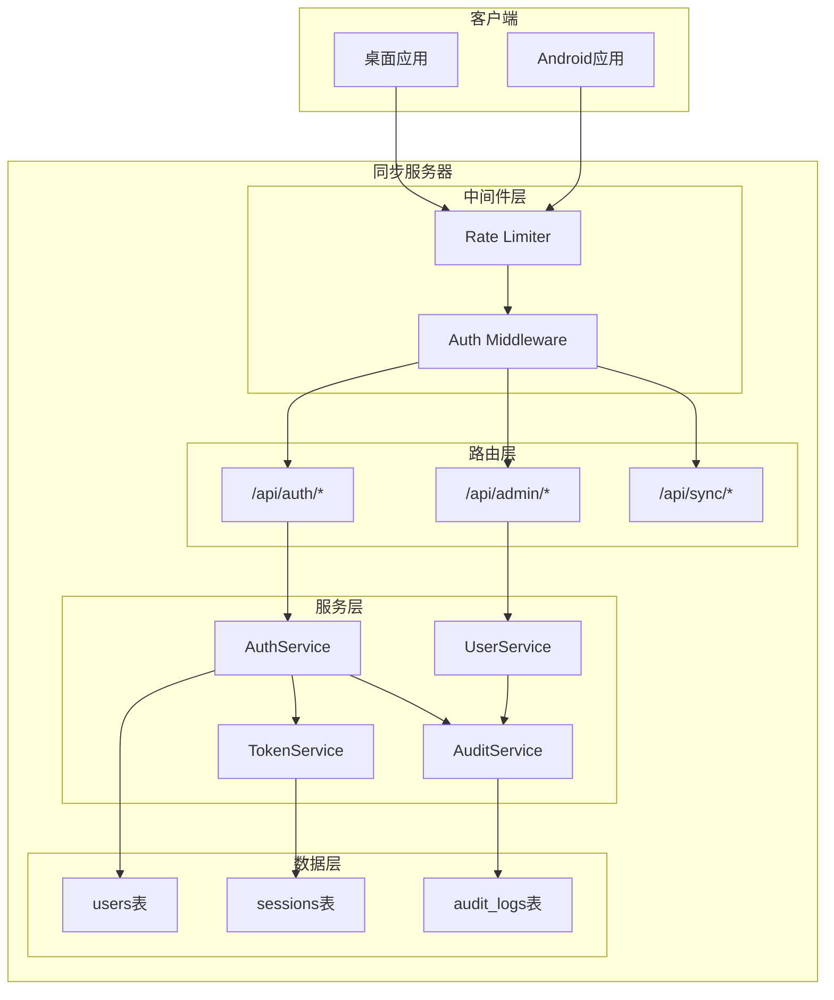

# Design Document

## Overview

本设计文档描述暮城笔记同步服务器用户认证系统的技术架构和实现方案。系统采用账号+密码+同步密钥的三重认证机制，使用 JWT 进行会话管理，bcrypt 进行密码哈希，并提供完整的用户管理和安全防护功能。

## Architecture



## Components and Interfaces

### 1. AuthService - 认证服务

负责用户注册、登录、密码管理等核心认证功能。

```typescript
interface AuthService {
  // 用户注册
  register(username: string, password: string, syncKey: string): Promise<RegisterResult>;
  
  // 用户登录
  login(username: string, password: string, syncKey: string): Promise<LoginResult>;
  
  // 刷新令牌
  refreshToken(refreshToken: string): Promise<TokenPair>;
  
  // 登出
  logout(userId: string, sessionId: string): Promise<void>;
  
  // 登出所有设备
  logoutAll(userId: string): Promise<void>;
  
  // 修改密码
  changePassword(userId: string, currentPassword: string, newPassword: string): Promise<void>;
  
  // 重置密码（使用同步密钥验证）
  resetPassword(username: string, syncKey: string, newPassword: string): Promise<void>;
  
  // 更新同步密钥
  updateSyncKey(userId: string, password: string, oldSyncKey: string, newSyncKey: string): Promise<void>;
}

interface RegisterResult {
  success: boolean;
  userId?: string;
  error?: string;
}

interface LoginResult {
  success: boolean;
  accessToken?: string;
  refreshToken?: string;
  expiresIn?: number;
  user?: UserInfo;
  error?: string;
}

interface TokenPair {
  accessToken: string;
  refreshToken: string;
  expiresIn: number;
}

interface UserInfo {
  id: string;
  username: string;
  role: 'user' | 'admin';
  createdAt: number;
}
```

### 2. TokenService - 令牌服务

负责 JWT 令牌的生成、验证和管理。

```typescript
interface TokenService {
  // 生成令牌对
  generateTokenPair(userId: string, syncKeyFingerprint: string): TokenPair;
  
  // 验证访问令牌
  verifyAccessToken(token: string): TokenPayload | null;
  
  // 验证刷新令牌
  verifyRefreshToken(token: string): RefreshTokenPayload | null;
  
  // 使令牌失效
  invalidateToken(tokenId: string): void;
  
  // 使用户所有令牌失效
  invalidateAllUserTokens(userId: string): void;
}

interface TokenPayload {
  userId: string;
  sessionId: string;
  syncKeyFingerprint: string;
  role: 'user' | 'admin';
  iat: number;
  exp: number;
}

interface RefreshTokenPayload {
  userId: string;
  sessionId: string;
  tokenId: string;
  iat: number;
  exp: number;
}
```

### 3. UserService - 用户服务

负责用户管理功能。

```typescript
interface UserService {
  // 获取用户信息
  getUser(userId: string): Promise<User | null>;
  
  // 获取用户列表（管理员）
  listUsers(page: number, limit: number): Promise<UserListResult>;
  
  // 禁用用户
  disableUser(userId: string): Promise<void>;
  
  // 启用用户
  enableUser(userId: string): Promise<void>;
  
  // 删除用户
  deleteUser(userId: string): Promise<void>;
  
  // 检查用户名是否存在
  usernameExists(username: string): Promise<boolean>;
}

interface User {
  id: string;
  username: string;
  role: 'user' | 'admin';
  status: 'active' | 'disabled';
  syncKeyFingerprint: string;
  createdAt: number;
  updatedAt: number;
  lastLoginAt?: number;
}

interface UserListResult {
  users: User[];
  total: number;
  page: number;
  limit: number;
}
```

### 4. RateLimiter - 频率限制器

防止暴力破解和 DDoS 攻击。

```typescript
interface RateLimiter {
  // 检查是否允许请求
  checkLimit(key: string, type: LimitType): Promise<RateLimitResult>;
  
  // 记录失败尝试
  recordFailure(key: string, type: LimitType): Promise<void>;
  
  // 重置计数器
  resetCounter(key: string, type: LimitType): Promise<void>;
  
  // 检查是否被封禁
  isBlocked(key: string): Promise<boolean>;
}

type LimitType = 'api' | 'login' | 'register';

interface RateLimitResult {
  allowed: boolean;
  remaining: number;
  resetAt: number;
  retryAfter?: number;
}
```

### 5. AuditService - 审计服务

记录安全相关的操作日志。

```typescript
interface AuditService {
  // 记录审计日志
  log(entry: AuditEntry): Promise<void>;
  
  // 查询审计日志
  query(filter: AuditFilter): Promise<AuditLogResult>;
}

interface AuditEntry {
  userId?: string;
  action: AuditAction;
  ip: string;
  userAgent?: string;
  details?: Record<string, unknown>;
  success: boolean;
}

type AuditAction = 
  | 'register'
  | 'login'
  | 'logout'
  | 'password_change'
  | 'sync_key_change'
  | 'user_disable'
  | 'user_enable'
  | 'admin_action';

interface AuditFilter {
  userId?: string;
  action?: AuditAction;
  startTime?: number;
  endTime?: number;
  page: number;
  limit: number;
}

interface AuditLogResult {
  logs: AuditLog[];
  total: number;
}

interface AuditLog extends AuditEntry {
  id: string;
  timestamp: number;
}
```

## Data Models

### 现有数据库表（保持不变）

```sql
-- items 表 - 存储所有同步数据项（需添加 user_id 字段）
-- 现有字段: id, type, payload, content_hash, remote_rev, deleted_time, 
--          created_time, updated_time, sync_status, local_rev, 
--          encryption_applied, schema_version
-- 新增字段: user_id

-- changes 表 - 变更日志（需添加 user_id 字段）
-- 现有字段: change_id, item_id, type, updated_time, deleted_time, 
--          content_hash, created_at
-- 新增字段: user_id

-- metadata 表 - 服务器元数据（保持不变）
-- 字段: key, value, updated_at

-- key_fingerprints 表 - 密钥指纹（需迁移）
-- 现有字段: api_key_hash, fingerprint, created_at, updated_at
-- 迁移后: user_id 替代 api_key_hash

-- sync_cursors 表 - 同步游标（需迁移）
-- 现有字段: api_key_hash, cursor, updated_at
-- 迁移后: user_id 替代 api_key_hash
```

### 新增数据库表

```sql
-- 用户表
CREATE TABLE IF NOT EXISTS users (
  id TEXT PRIMARY KEY,
  username TEXT UNIQUE NOT NULL,
  password_hash TEXT NOT NULL,
  sync_key_fingerprint TEXT NOT NULL,
  role TEXT DEFAULT 'user' CHECK(role IN ('user', 'admin')),
  status TEXT DEFAULT 'active' CHECK(status IN ('active', 'disabled')),
  created_at INTEGER NOT NULL,
  updated_at INTEGER NOT NULL,
  last_login_at INTEGER
);

-- 会话表
CREATE TABLE IF NOT EXISTS sessions (
  id TEXT PRIMARY KEY,
  user_id TEXT NOT NULL,
  refresh_token_hash TEXT NOT NULL,
  device_info TEXT,
  ip_address TEXT,
  created_at INTEGER NOT NULL,
  expires_at INTEGER NOT NULL,
  revoked INTEGER DEFAULT 0,
  FOREIGN KEY (user_id) REFERENCES users(id) ON DELETE CASCADE
);

-- 审计日志表
CREATE TABLE IF NOT EXISTS audit_logs (
  id TEXT PRIMARY KEY,
  user_id TEXT,
  action TEXT NOT NULL,
  ip_address TEXT NOT NULL,
  user_agent TEXT,
  details TEXT,
  success INTEGER NOT NULL,
  timestamp INTEGER NOT NULL
);

-- 频率限制表
CREATE TABLE IF NOT EXISTS rate_limits (
  key TEXT PRIMARY KEY,
  count INTEGER NOT NULL,
  window_start INTEGER NOT NULL,
  blocked_until INTEGER
);

-- 新增索引
CREATE INDEX IF NOT EXISTS idx_users_username ON users(username);
CREATE INDEX IF NOT EXISTS idx_sessions_user_id ON sessions(user_id);
CREATE INDEX IF NOT EXISTS idx_sessions_expires_at ON sessions(expires_at);
CREATE INDEX IF NOT EXISTS idx_audit_logs_user_id ON audit_logs(user_id);
CREATE INDEX IF NOT EXISTS idx_audit_logs_timestamp ON audit_logs(timestamp);
CREATE INDEX IF NOT EXISTS idx_audit_logs_action ON audit_logs(action);
CREATE INDEX IF NOT EXISTS idx_items_user_id ON items(user_id);
CREATE INDEX IF NOT EXISTS idx_changes_user_id ON changes(user_id);
```

### 数据库迁移策略

1. **添加 user_id 字段到 items 表**
   ```sql
   ALTER TABLE items ADD COLUMN user_id TEXT;
   CREATE INDEX IF NOT EXISTS idx_items_user_id ON items(user_id);
   ```

2. **添加 user_id 字段到 changes 表**
   ```sql
   ALTER TABLE changes ADD COLUMN user_id TEXT;
   CREATE INDEX IF NOT EXISTS idx_changes_user_id ON changes(user_id);
   ```

3. **迁移 key_fingerprints 数据**
   - 为每个 api_key_hash 创建对应的默认用户
   - 将 fingerprint 关联到新用户

4. **迁移 sync_cursors 数据**
   - 将 api_key_hash 映射到对应的 user_id

5. **向后兼容**
   - API Key 认证时，查找或创建默认用户
   - 默认用户的 user_id 基于 api_key_hash 生成

### JWT Token 结构

```typescript
// Access Token Payload
interface AccessTokenPayload {
  sub: string;           // 用户ID
  sid: string;           // 会话ID
  skf: string;           // 同步密钥指纹
  role: string;          // 用户角色
  iat: number;           // 签发时间
  exp: number;           // 过期时间 (1小时)
}

// Refresh Token Payload
interface RefreshTokenPayload {
  sub: string;           // 用户ID
  sid: string;           // 会话ID
  tid: string;           // 令牌ID
  iat: number;           // 签发时间
  exp: number;           // 过期时间 (7天)
}
```

// Express 请求扩展（设计文档中需要扩展）
declare global {
  namespace Express {
    interface Request {
      apiKeyHash?: string;      // 现有：API Key 哈希
      userId?: string;          // 新增：用户ID
      sessionId?: string;       // 新增：会话ID
      userRole?: 'user' | 'admin';  // 新增：用户角色
      syncKeyFingerprint?: string;  // 新增：同步密钥指纹
      authMethod?: 'apiKey' | 'jwt';  // 新增：认证方式
    }
  }
}
```

### 与现有代码的兼容性

**现有 ItemBase 接口（sync-server/src/types/index.ts）：**
```typescript
interface ItemBase {
  id: string;
  type: ItemType;
  created_time: number;
  updated_time: number;
  deleted_time: number | null;
  payload: string;
  content_hash: string;
  sync_status: SyncStatus;
  local_rev: number;
  remote_rev: string | null;
  encryption_applied: 0 | 1;
  schema_version: number;
  // 新增字段（可选，向后兼容）
  user_id?: string;
}
```

**现有 ItemType 类型（保持不变）：**
```typescript
type ItemType = 
  | 'note'
  | 'folder'
  | 'tag'
  | 'resource'
  | 'todo'
  | 'vault_entry'
  | 'vault_folder'
  | 'bookmark'
  | 'bookmark_folder'
  | 'diagram'
  | 'ai_config'
  | 'ai_conversation'
  | 'ai_message';
```

## Correctness Properties

*A property is a characteristic or behavior that should hold true across all valid executions of a system-essentially, a formal statement about what the system should do. Properties serve as the bridge between human-readable specifications and machine-verifiable correctness guarantees.*

### Property 1: 密码哈希不可逆性
*For any* 密码字符串，使用 bcrypt 哈希后的结果不应能被逆向还原为原始密码，且相同密码的两次哈希结果应不同（因为盐值不同）。
**Validates: Requirements 1.5, 7.3**

### Property 2: 令牌验证一致性
*For any* 有效的访问令牌，验证后提取的用户ID和同步密钥指纹应与生成时的输入完全一致。
**Validates: Requirements 3.5, 4.1**

### Property 3: 会话隔离性
*For any* 两个不同用户的会话，使用一个用户的令牌不应能访问另一个用户的数据。
**Validates: Requirements 5.1, 5.2, 5.3**

### Property 4: 频率限制有效性
*For any* IP地址，在限制窗口内超过阈值的请求应被拒绝，且拒绝响应应包含正确的重试时间。
**Validates: Requirements 9.1, 9.2**

### Property 5: 令牌失效传播
*For any* 被撤销的会话，其对应的访问令牌和刷新令牌都应立即失效，后续使用这些令牌的请求应被拒绝。
**Validates: Requirements 3.3, 3.4, 7.5**

### Property 6: 同步密钥指纹一致性
*For any* 同步密钥，其 SHA-256 指纹应是确定性的，相同密钥总是产生相同指纹。
**Validates: Requirements 1.6, 8.3, 8.4**

### Property 7: 用户数据隔离完整性
*For any* 数据查询操作，返回的数据集应只包含当前认证用户拥有的数据，不应包含其他用户的数据。
**Validates: Requirements 5.2, 5.3**

## Error Handling

### 错误码定义

| 错误码 | HTTP状态 | 描述 |
|--------|----------|------|
| AUTH_001 | 401 | 未提供认证信息 |
| AUTH_002 | 401 | 访问令牌无效或已过期 |
| AUTH_003 | 403 | 刷新令牌无效或已过期 |
| AUTH_004 | 403 | 用户名或密码错误 |
| AUTH_005 | 403 | 同步密钥验证失败 |
| AUTH_006 | 403 | 账号已被禁用 |
| AUTH_007 | 409 | 用户名已存在 |
| AUTH_008 | 400 | 密码强度不足 |
| AUTH_009 | 400 | 同步密钥长度不足 |
| AUTH_010 | 429 | 请求过于频繁 |
| AUTH_011 | 403 | 账号已被锁定 |
| AUTH_012 | 403 | 无管理员权限 |

### 错误响应格式

```typescript
interface ErrorResponse {
  error: {
    code: string;
    message: string;
    details?: Record<string, unknown>;
  };
}
```

### 安全错误处理原则

1. 不泄露用户是否存在的信息（用户名错误和密码错误返回相同错误）
2. 不在错误消息中包含敏感信息
3. 记录详细错误到服务器日志，但只返回通用错误给客户端
4. 对于频率限制错误，返回重试时间

## Testing Strategy

### 单元测试

1. **密码哈希测试**
   - 测试 bcrypt 哈希生成
   - 测试密码验证
   - 测试不同密码产生不同哈希

2. **令牌服务测试**
   - 测试令牌生成
   - 测试令牌验证
   - 测试过期令牌拒绝
   - 测试无效令牌拒绝

3. **频率限制测试**
   - 测试正常请求通过
   - 测试超限请求拒绝
   - 测试窗口重置

### 属性测试

使用 fast-check 进行属性测试，每个测试至少运行100次迭代。

1. **Property 1 测试**: 密码哈希不可逆性
   - 生成随机密码，验证哈希后无法还原
   - 验证相同密码两次哈希结果不同

2. **Property 2 测试**: 令牌验证一致性
   - 生成随机用户数据，创建令牌，验证解析结果一致

3. **Property 6 测试**: 同步密钥指纹一致性
   - 生成随机密钥，验证多次计算指纹结果相同

### 集成测试

1. **注册流程测试**
   - 正常注册
   - 重复用户名
   - 弱密码
   - 短密钥

2. **登录流程测试**
   - 正常登录
   - 错误密码
   - 错误密钥
   - 账号锁定

3. **会话管理测试**
   - 令牌刷新
   - 登出
   - 多设备登出

4. **数据隔离测试**
   - 用户A无法访问用户B的数据
   - 用户A的令牌无法操作用户B的资源
