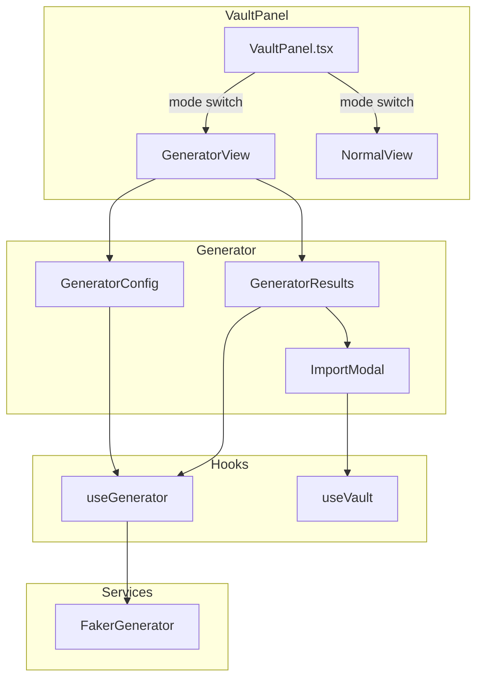

# Design Document: Vault Data Generator

## Overview

密码/资料生成器是密码库的扩展功能，使用 Faker.js 库在本地生成虚假但格式正确的用户资料。该功能集成在现有的 VaultPanel 组件中，通过切换视图模式来显示生成器界面。生成的数据可以直接导入到密码库作为新条目。

## Architecture



## Components and Interfaces

### 1. GeneratorView Component

主生成器视图组件，替换 VaultPanel 的中间和右侧区域。

```typescript
interface GeneratorViewProps {
  folders: VaultFolder[];
  onBack: () => void;
  onImport: (profile: GeneratedProfile, folderId: string | null) => Promise<void>;
}
```

### 2. GeneratorConfig Component

生成器配置面板，包含所有生成选项。

```typescript
interface GeneratorConfigProps {
  config: GeneratorOptions;
  onChange: (config: GeneratorOptions) => void;
  onGenerate: () => void;
  loading: boolean;
}

interface GeneratorOptions {
  country: CountryCode;
  gender: 'random' | 'male' | 'female';
  quantity: number;
  includeFields: {
    name: boolean;
    address: boolean;
    phone: boolean;
    email: boolean;
    company: boolean;
  };
  passwordOptions: {
    length: number;           // 密码长度，默认 16，范围 8-64
    uppercase: boolean;       // 包含大写字母，默认 true
    lowercase: boolean;       // 包含小写字母，默认 true
    numbers: boolean;         // 包含数字，默认 true
    symbols: boolean;         // 包含特殊符号，默认 true
  };
}

type CountryCode = 'en_US' | 'zh_CN' | 'ja' | 'ko' | 'en_GB' | 'de' | 'fr' | 'ru';
```

### 3. GeneratorResults Component

生成结果展示组件，支持紧凑和展开两种视图模式。

```typescript
interface GeneratorResultsProps {
  profiles: GeneratedProfile[];
  viewMode: 'compact' | 'expanded';  // 视图模式
  onViewModeChange: (mode: 'compact' | 'expanded') => void;
  onCopyField: (value: string, label: string) => void;
  onCopyAll: (profile: GeneratedProfile) => void;
  onImport: (profile: GeneratedProfile) => void;
  onBatchImport: () => void;
}
```

**紧凑视图模式（批量生成时默认）：**
- 表格形式展示，每行一条记录
- 列：序号、用户名、密码（带显示/隐藏切换）、操作按钮
- 可选字段折叠显示，点击展开查看详情
- 支持全选进行批量操作

**展开视图模式（单条生成时默认）：**
- 卡片形式展示完整信息
- 每个字段独立显示，带复制按钮

interface GeneratedProfile {
  id: string;
  username: string;
  password: string;
  firstName?: string;
  lastName?: string;
  fullName?: string;
  address?: string;
  phone?: string;
  email?: string;
  company?: string;
  generatedAt: number;
}
```

### 4. ImportModal Component

导入确认弹窗。

```typescript
interface ImportModalProps {
  visible: boolean;
  profile: GeneratedProfile | null;
  profiles?: GeneratedProfile[];  // 批量导入时使用
  folders: VaultFolder[];
  onConfirm: (folderId: string | null) => void;
  onCancel: () => void;
  loading: boolean;
}
```

### 5. useGenerator Hook

生成器核心逻辑 Hook。

```typescript
interface UseGeneratorReturn {
  profiles: GeneratedProfile[];
  loading: boolean;
  generate: (options: GeneratorOptions) => void;
  clearProfiles: () => void;
}
```

### 6. FakerGenerator Service

Faker 封装服务，处理不同国家/性别的数据生成。

```typescript
interface FakerGeneratorService {
  generateProfile(options: GeneratorOptions): GeneratedProfile;
  generateBatch(options: GeneratorOptions): GeneratedProfile[];
}
```

## Data Models

### GeneratedProfile

```typescript
interface GeneratedProfile {
  id: string;              // UUID
  username: string;        // 生成的用户名
  password: string;        // 生成的密码
  firstName?: string;      // 名
  lastName?: string;       // 姓
  fullName?: string;       // 全名（根据国家格式化）
  address?: string;        // 完整地址
  phone?: string;          // 电话号码
  email?: string;          // 邮箱地址
  company?: string;        // 公司名称
  generatedAt: number;     // 生成时间戳
}
```

### Country Configuration

```typescript
const COUNTRY_CONFIG: Record<CountryCode, { label: string; fakerLocale: string }> = {
  'en_US': { label: '美国', fakerLocale: 'en_US' },
  'zh_CN': { label: '中国', fakerLocale: 'zh_CN' },
  'ja': { label: '日本', fakerLocale: 'ja' },
  'ko': { label: '韩国', fakerLocale: 'ko' },
  'en_GB': { label: '英国', fakerLocale: 'en_GB' },
  'de': { label: '德国', fakerLocale: 'de' },
  'fr': { label: '法国', fakerLocale: 'fr' },
  'ru': { label: '俄罗斯', fakerLocale: 'ru' },
};
```


## Correctness Properties

*A property is a characteristic or behavior that should hold true across all valid executions of a system-essentially, a formal statement about what the system should do. Properties serve as the bridge between human-readable specifications and machine-verifiable correctness guarantees.*

### Property 1: Profile always contains username and valid password

*For any* generated profile with any configuration options, the profile SHALL contain a non-empty username string and a password string matching the configured length (default 16, range 8-64) containing only characters from the enabled character sets (uppercase, lowercase, numbers, symbols).

**Validates: Requirements 2.3, 4.3**

### Property 2: Optional fields inclusion

*For any* generation configuration where an optional field checkbox is enabled, the resulting profile SHALL contain a non-empty value for that corresponding field. Conversely, if a checkbox is disabled, the field SHALL be undefined or empty.

**Validates: Requirements 3.3**

### Property 3: Batch generation quantity

*For any* batch generation request with quantity N (where 1 ≤ N ≤ 100), the generator SHALL produce exactly N distinct profiles.

**Validates: Requirements 5.6**

### Property 4: Import field mapping

*For any* import operation of a generated profile, the resulting vault entry SHALL have:
- username field equal to profile.username
- password field equal to profile.password
- notes field containing all optional fields (name, address, phone, email, company) that were present in the profile

**Validates: Requirements 6.4, 6.5**

### Property 5: Batch import creates correct entries

*For any* batch import of N profiles to a folder, exactly N new vault entries SHALL be created in that folder, each with correctly mapped fields per Property 4.

**Validates: Requirements 6.8**

### Property 6: Invalid quantity rejection

*For any* quantity value outside the range [1, 100], the generator SHALL reject the generation request and not produce any profiles.

**Validates: Requirements 8.3**

## Error Handling

### Generation Errors

1. **Faker Initialization Failure**: If Faker fails to initialize with a locale, fall back to 'en_US' and show a warning
2. **Invalid Configuration**: Validate all inputs before generation, show specific error messages for invalid values
3. **Memory Limits**: For large batch sizes, generate profiles in chunks to prevent memory issues

### Import Errors

1. **Database Errors**: If vault entry creation fails, show error message and preserve generated data
2. **Folder Not Found**: If selected folder was deleted, prompt user to select another folder
3. **Partial Batch Failure**: If some entries fail during batch import, report which succeeded and which failed

## Testing Strategy

### Unit Tests

Unit tests will cover:
- Default configuration values
- UI component rendering
- Copy to clipboard functionality
- Form validation

### Property-Based Tests

Property-based tests using fast-check will validate:
- Profile generation always includes username and password (Property 1)
- Optional field inclusion matches configuration (Property 2)
- Batch generation produces correct quantity (Property 3)
- Import field mapping correctness (Property 4)
- Batch import entry count (Property 5)
- Invalid quantity rejection (Property 6)

Each property test will run minimum 100 iterations with randomly generated configurations.

### Test Configuration

```typescript
// Test tag format
// Feature: vault-data-generator, Property N: [property description]

import fc from 'fast-check';

// Arbitrary for GeneratorOptions
const generatorOptionsArb = fc.record({
  country: fc.constantFrom('en_US', 'zh_CN', 'ja', 'ko', 'en_GB', 'de', 'fr', 'ru'),
  gender: fc.constantFrom('random', 'male', 'female'),
  quantity: fc.integer({ min: 1, max: 100 }),
  includeFields: fc.record({
    name: fc.boolean(),
    address: fc.boolean(),
    phone: fc.boolean(),
    email: fc.boolean(),
    company: fc.boolean(),
  }),
});
```

## Implementation Notes

### Faker.js Integration

The project will use `@faker-js/faker` package. Each locale requires separate import:

```typescript
import { faker } from '@faker-js/faker';
import { fakerZH_CN } from '@faker-js/faker/locale/zh_CN';
import { fakerJA } from '@faker-js/faker/locale/ja';
// etc.
```

### Password Generation

Reuse the existing `generatePassword` function from `useVault.ts` to maintain consistency with the vault's password generation.

### Notes Field Formatting

When importing, format the notes field as:

```
姓名: [fullName]
地址: [address]
电话: [phone]
邮箱: [email]
工作单位: [company]
```

Only include fields that have values.
